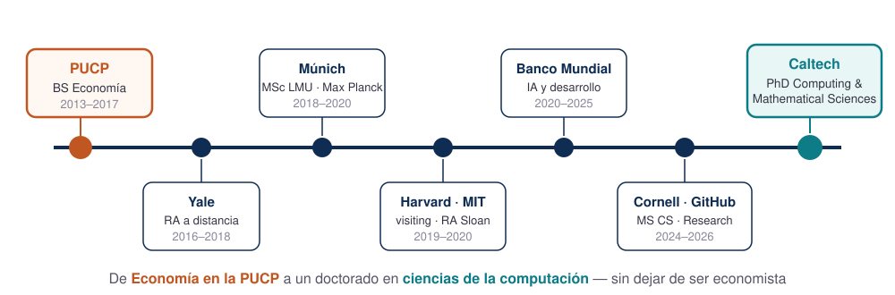
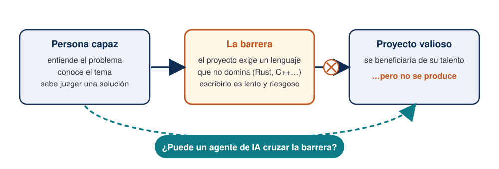
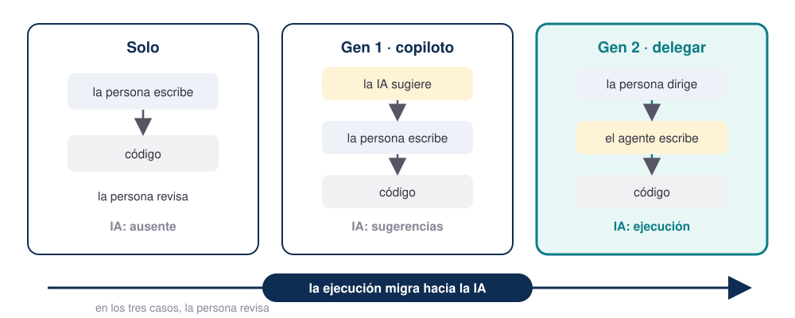
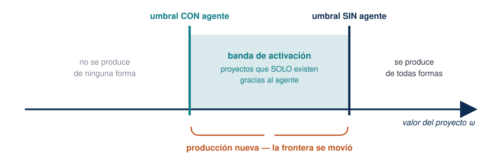
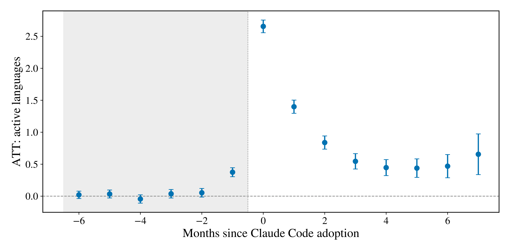
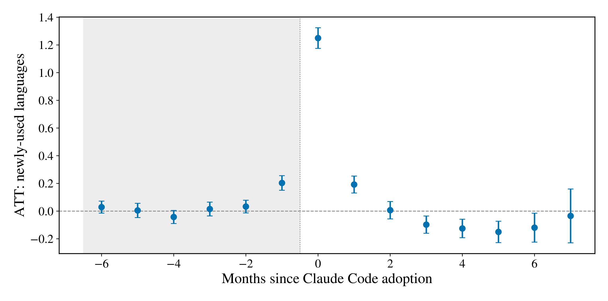
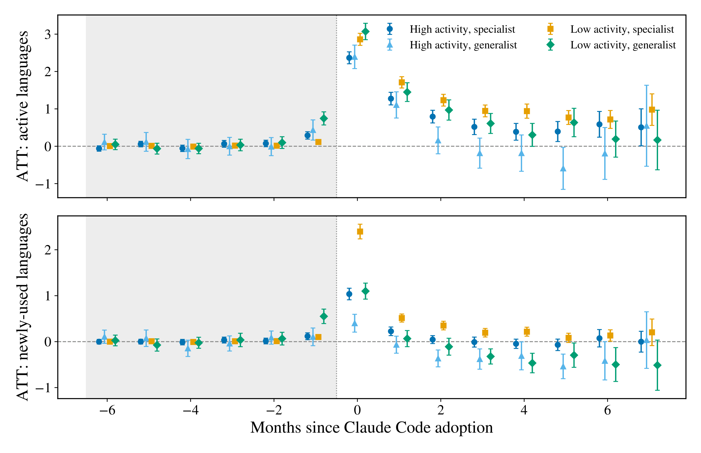

## El plan de hoy: tres historias {.smaller}

| | Historia | Qué quiero que se lleven |
|---|---|---|
| 1 | **Mi ruta** — de este campus a Caltech | Que el camino existe, y empieza aquí |
| 2 | **Un paper** — lo que presenté en Harvard en julio | Que la IA también es una pregunta económica |
| 3 | **Cómo investigo hoy** — agentes de IA sobre datos peruanos | Que la barrera técnica acaba de caer |

. . .

[45 minutos de charla, 30 de preguntas — y las preguntas son la mejor parte.]{.warm}

# Parte 1 — Mi ruta

## Hace 10 años yo estaba sentado donde ustedes {.smaller}

{.nostretch width=94% fig-align="center"}

Ninguna etapa estaba planeada desde el inicio. Cada una abrió la puerta de la siguiente.

[Las tres primeras, en una línea: beca completa **5 años consecutivos** en la PUCP · asistente de investigación **para Yale desde Lima**, siendo aún alumno · maestría en Múnich con la beca de intercambio + DAAD.]{.small .muted}

## Harvard y MIT: encontré mi tema (2019–2020) {.smaller}

- **Visiting scholar en Harvard** — Laboratory for Innovation Science, con Karim Lakhani.
- **Research associate en MIT Sloan**: cómo la tecnología (los contenedores, los barcos, los cables) redujo los costos de comerciar y comunicarse.

. . .

::: {.callout-tip}
## La cosa bonita
Ahí lo vi claro: **la tecnología es una pregunta económica**. Quién adopta, quién queda fuera, qué se produce que antes no — ese es mi tema hasta hoy.
:::

## Banco Mundial: investigar y construir (2020–2025) {.smaller}

- Lideré la investigación sobre el **impacto de ChatGPT en los desarrolladores de software**, con datos administrativos de GitHub.
- Enseñé **Causal Machine Learning** a nivel de posgrado y construí herramientas con IA para investigación en desarrollo.

. . .

Y en paralelo, la parte que más lejos ha viajado:

| | |
|---|---|
| Libro con **Victor Chernozhukov** (MIT) | se usa en el curso 14.38 de MIT |
| Mi libro de **Causal ML con Python** | se usa en un curso de Stanford |
| `csdid.py`, con **Pedro Sant'Anna** | **464 000 descargas** |

. . .

::: {.callout-tip}
## La cosa bonita
Lo que publiquen **gratis y abierto** viaja más lejos que ustedes: un paquete escrito por un economista de la PUCP corre hoy en universidades de todo el mundo.
:::

## Hoy: la frontera entre dos carreras desapareció {.smaller}

- **Microsoft–GitHub Research** (2024–2026): economía de la IA agéntica y el software libre — 3.15 millones de commits, 5 346 desarrolladores.
- **MS en Computer Science, Cornell** (2024–2025).
- **PhD en Computing & Mathematical Sciences, Caltech** (2025–2029).

. . .

::: {.callout-tip}
## La cosa bonita
No "dejé" la economía por la computación: hoy son **una sola caja de herramientas**. Y el que llega desde economía trae lo que más escasea allá: saber qué pregunta vale la pena.
:::

# El contexto — dos fortalezas cayeron

## 2025: el año en que el código se rindió {.smaller}

{height=42} &nbsp; {height=34}

- **Mayo 2025:** Anthropic lanza **Claude Code** — el primer *agente* de código masivo: ya no sugiere líneas, **ejecuta el trabajo**.
- Hoy lo usa **~39% de los desarrolladores profesionales del mundo** (47% en EE. UU.) — y **9 de cada 10** usan agentes de IA al menos cada semana.
- **~4 de cada 100 commits públicos de GitHub** ya los escribe Claude Code.
- El propio creador de la herramienta: *no edita código a mano desde noviembre de 2025*.

. . .

[La palabra del año fue **agente**: la IA pasó de sugerir (copiloto) a ejecutar (delegar). Guárdenla: va a reaparecer cuando lleguemos al paper.]{.warm}

## 2026: la IA entró a la matemática de frontera {.smaller}

{height=30} &nbsp;&nbsp;&nbsp; {height=34}

- Los **problemas de Erdős**: cientos de preguntas abiertas que dejó Paul Erdős — algunas llevaban **80 años** sin respuesta.
- **Enero 2026:** primera resolución **autónoma** de un problema de Erdős por un sistema de IA, con prueba formal verificada en Lean.
- **Mayo 2026:** un modelo de OpenAI encuentra un **contraejemplo** al problema de la distancia unitaria — una conjetura de Erdős **de 1946**. Los matemáticos: *"esto merecía publicarse en una revista top"*.
- Y los mejores del campo — **Terence Tao** incluido — ya publican resolviendo estos problemas **junto con** estos sistemas.

. . .

[Titular de Quanta Magazine, agosto 2026: *"Why the Legendary Erdős Problems Are Falling to AI".*]{.warm}

## ¿Por qué les cuento esto en un curso de economía? {.smaller}

Fíjense **qué** cayó primero: el código y la matemática — los dos **lenguajes formales**, donde verificar una respuesta es barato y el error no se puede esconder.

. . .

Y ahora piensen qué disciplina habla **los dos idiomas a la vez**:

> La economía modela con **matemática** y contrasta con **datos y código**.

. . .

[La pregunta ya no es *si* esto llega a la economía — **ya llegó**. Primero les muestro cómo lo **estudio** como economista; después, cómo lo **uso** todos los días.]{.warm}

# Parte 2 — La IA como objeto de estudio

## El paper que presenté en Harvard {.smaller}

> **Agentic Delegation and the Language Frontier of Software Developers**
> *A Model and Evidence from Claude Code on GitHub*

Con **Kevin Xu** (GitHub) · Open & User Innovation Conference 2026, **Harvard Business School** · arXiv:2605.25438

. . .

La pregunta, en una línea:

**¿Los agentes de IA solo nos hacen trabajar más rápido — o amplían *lo que* podemos producir?**

. . .

[Aquí la IA es mi *objeto de estudio* — con teoría económica y econometría de las que enseña este departamento. Al final les muestro la otra cara: la IA como *herramienta* de todos los días.]{.warm}

## El problema económico: una barrera de habilidad {.smaller}

{.nostretch width=88% fig-align="center"}

Piénsenlo como economistas: hay **valor que se queda sin producir** porque falta una habilidad específica — no talento general.

## Tres formas de producir el mismo proyecto {.smaller}

{.nostretch width=80% fig-align="center"}

La generación 1 (el autocompletado) **amplifica la habilidad que uno ya tiene**. La generación 2 (delegar) es distinta: el agente ejecuta **lo que uno no sabe escribir** — y uno dirige y revisa.

## El modelo, en una figura {.smaller}

Un proyecto se emprende solo si su valor supera un **umbral** (como casi todo en economía). El agente **baja ese umbral**:

{.nostretch width=88% fig-align="center"}

[La predicción: al adoptar el agente, la gente empieza a producir en lenguajes que **jamás había usado**. Eso es lo que vamos a buscar en los datos.]{.warm}

## Los datos: la adopción deja huella pública {.smaller}

Cuando Claude Code coescribe un commit en GitHub, lo **firma**. Esa firma nos deja fechar la adopción de cada desarrollador:

| | |
|---|---|
| Commits firmados por Claude observados | **~23 millones** |
| Adoptantes sostenidos en el panel | **6 120 desarrolladores** |
| Sus historiales públicos | 3.4M commits · **~60M archivos** |
| Ventana | 28 meses, cohortes Abr 2025 – Mar 2026 |

. . .

**El método** — el mismo que enseño en mis cursos: diferencias en diferencias escalonado (Callaway–Sant'Anna), comparando adoptantes tempranos contra los que adoptan después. [Sí: el mismo **Sant'Anna** del paquete de las 464 mil descargas. El mundo es un pañuelo.]{.small .muted}

## Resultado 1: la actividad se expande {.smaller}

{.nostretch width=72% fig-align="center"}

Al adoptar, **+2.7 lenguajes activos** en el mes (la base era 0.7) — y en los 12 meses previos, nada: no es que ya vinieran en expansión.

## Resultado 2: producen lo que nunca habían producido {.smaller}

{.nostretch width=72% fig-align="center"}

**+1.25 lenguajes usados por primera vez en la vida** — 4 veces la tasa normal de entrada. Y no es flor de un día: casi la mitad se **vuelve a usar** en los meses siguientes.

## Resultado 3: ¿quién se expande más? Los especialistas {.smaller}

{.nostretch width=56% fig-align="center"}

Los **especialistas** (pocos lenguajes previos) entran a **2–3× más** lenguajes nuevos que los generalistas — exactamente lo que predice el modelo: tenían más frontera por delante.

## Lo que esto significa (y lo que no) {.smaller}

- La IA agéntica no solo **acelera**: mueve la **frontera de producción**. Hay proyectos que no existirían sin ella.
- Si las barreras de habilidad específica caen, cambia una pregunta central de la economía: **¿quién puede contribuir a qué?**
- La expansión es **producción, no aprendizaje**: la persona entrega código en Rust sin necesariamente haber aprendido Rust. (Discutan las implicancias — da para un ensayo entero.)

. . .

::: {.callout-warning}
## La honestidad metodológica que este departamento les va a exigir siempre
La adopción es **voluntaria**: esto son asociaciones en tiempo de evento con controles exigentes — no un experimento. Lo decimos en el paper con todas sus letras.
:::

# Parte 3 — Cómo investigo hoy

## Su curso es mi laboratorio {.smaller}

Este semestre ustedes estudian la **economía peruana**. Les muestro cómo la investigaría hoy, con una pregunta real:

> En los departamentos mineros del Perú, ¿la renta minera **reduce** la conflictividad social — o solo cambia **aquello por lo que se protesta**?

. . .

Los datos existen y son públicos: los reportes de conflictos de la **Defensoría del Pueblo**, la producción minera del **MINEM**, las mesas de diálogo de la **PCM**, los proyectos de ley del **Congreso**.

. . .

[El problema nunca fueron los datos. Era el **costo de convertirlos en investigación**. Eso es lo que acaba de cambiar.]{.warm}

## La herramienta: un agente de IA {.smaller}

{width=58% fig-align="center"}

Un **agente** no es un chat al que le pegan texto: vive en su computadora, **ve sus archivos**, escribe y ejecuta código, **lee sus propios errores y los corrige**. Ustedes dirigen; él ejecuta.

## El problema, en crudo: 269 reportes en PDF {.smaller}

{.nostretch width=71% fig-align="center"}

La serie de conflictos de la Defensoría existe desde 2004 — **caso por caso, con narrativa** — pero solo en PDF. Nadie la tiene como base de datos. *Nadie.*

[Y los años viejos (2004–2015) son **escaneados**: el PDF es una foto. Para eso existe **PaddleOCR** — OCR gratuito y local que extrae **texto y tablas** de la imagen: [github.com/PaddlePaddle/PaddleOCR](https://github.com/PaddlePaddle/PaddleOCR)]{.small}

## Lo que hace el agente, por dentro {.smaller}

{.nostretch width=88% fig-align="center"}

## Y para la literatura: un equipo entero {.smaller}

{.nostretch width=94% fig-align="center"}

En Claude Code esto es **un solo comando: `/deep-research`**. Una revisión que tomaba semanas: ~100 agentes en paralelo, ~20 minutos, citas **verificadas entre ellos** — y los PDFs descargados en su carpeta.

## La voz también se vuelve dato {.smaller}

{.nostretch width=90% fig-align="center"}

Con **Whisper** (gratuito y local), 12 minutos de video sobre conflictos sociales se transcriben en **9 segundos** — y las entrevistas de campo, las clases y los seminarios dejan de evaporarse.

[Para usarlo: [github.com/openai/whisper](https://github.com/openai/whisper) · en Mac, el modelo rápido [huggingface.co/mlx-community/whisper-large-v3-turbo](https://huggingface.co/mlx-community/whisper-large-v3-turbo) · en Windows, [github.com/SYSTRAN/faster-whisper](https://github.com/SYSTRAN/faster-whisper)]{.small .muted}

## Esto no es el futuro: sus profesores ya están ahí {.smaller}

Este ciclo se lo enseñamos **este mes** a los docentes de la Facultad de Ciencias Sociales — dos sesiones completas, públicas, paso a paso. **Todos los enlaces, para llevar:**

| Qué | Dónde |
|---|---|
| El sitio completo del taller | [alexanderquispe.github.io/claude-code-research](https://alexanderquispe.github.io/claude-code-research) |
| Sesión 1 — Confianza y verificación | […/profesores/sesion1-confianza.html](https://alexanderquispe.github.io/claude-code-research/profesores/sesion1-confianza.html) |
| Sesión 2 — Git, datos, OCR, Whisper, MCPs | […/profesores/sesion2-flujo.html](https://alexanderquispe.github.io/claude-code-research/profesores/sesion2-flujo.html) |
| Estos mismos slides | […/charlas/ia-economia.html](https://alexanderquispe.github.io/claude-code-research/charlas/ia-economia.html) |
| Claude Code — documentación oficial | [code.claude.com/docs](https://code.claude.com/docs) |

. . .

**Todo el material es de ustedes también.** Si sus profesores están aprendiendo esto a mitad de carrera, ustedes tienen la ventaja de empezar desde ya.

. . .

[La regla que les enseñamos a ellos vale igual para ustedes: la IA **recuerda** rápido y **se equivoca** con confianza — todo lo que importe, se **verifica** contra la fuente.]{.warm}

# Cierre

## ¿Y ustedes? {.smaller}

Están estudiando **economía peruana** en el mejor momento posible:

1. **Los datos del Perú están ahí** — Defensoría, MINEM, INEI, Congreso — esperando a quien los convierta en investigación.
2. **La barrera técnica acaba de caer.** Lo que me tomó años de código, hoy se dirige conversando.
3. Lo que se volvió escaso — y valioso — es lo que enseña este curso: **buenas preguntas, contexto peruano, y el criterio para verificar**.

. . .

[La IA ejecuta. La pregunta, el diseño y el juicio siguen siendo de ustedes. Esa es la parte del economista — y no está en riesgo: hoy se cotiza más que nunca.]{.warm}

## Suban la vara: más matemática, más datos {.smaller}

Mi invitación concreta para sus trabajos y sus tesis:

1. **Más matemática.** Que sus papers tengan modelo, no solo descripción: la formalización es lo que convierte una opinión en un argumento contrastable.
2. **Problemas más intensivos en datos.** La serie completa: los 269 reportes, el texto entero del Congreso, las imágenes satelitales. Que la ambición del problema mande.

. . .

**¿Y con qué?** Con lo que ya tienen: los modelos de OpenAI, **Claude Code**, los modelos abiertos de **Hugging Face** y las herramientas de **GitHub** corren **en su propia laptop** — cosas que hace diez años pedían una supercomputadora.

. . .

[El presupuesto tampoco es excusa: lo pagado cuesta **US$20 al mes** — Claude Pro o ChatGPT Plus, y con **una** basta. Hugging Face y GitHub son **gratis**. La supercomputadora de hace una década hoy cuesta lo que una pizza.]{.warm}

## Cómo empezar esta semana {.smaller}

1. **Usen el material del taller de sus profesores** (público): [alexanderquispe.github.io/claude-code-research]{.small}
2. **Tomen en serio la econometría y la causalidad** — es exactamente lo que la IA no decide por ustedes.
3. **Publiquen lo que hagan** — código, datos, notas. Lo abierto viaja (pregúntenle a `csdid.py`).
4. Y cuando algo les salga mal con la IA: **verifiquen, no confíen**. Ese hábito vale más que cualquier herramienta.

## Gracias {.smaller}

**Alexander Quispe**

- aquisper@caltech.edu
- alexanderquispe.github.io
- El paper: arXiv:2605.25438

. . .

[Ahora sí: **30 minutos de preguntas** — pregunten lo que quieran: la ruta, las becas, la IA, el paper o cómo empezar.]{.big}

[Estos slides fueron escritos, diagramados y compilados con Claude Code — como todo lo que les acabo de contar.]{.small .muted}
