## Plan de hoy (3 horas) {.smaller}

| Hora | Bloque | Tema |
|------|--------|------|
| 6:00 – 6:20 | 1 | Qué es Claude y sus tres productos |
| 6:20 – 6:50 | 2 | VS Code y el terminal, paso a paso |
| 6:50 – 7:10 | 3 | Configuración: modelo, effort, modos |
| 7:10 – 7:20 | ☕ | Pausa 1 |
| 7:20 – 7:45 | 4 | Lo primero: `/init` y markdown |
| 7:45 – 8:05 | 5 | Trabajar: conversar y ordenar |
| 8:05 – 8:15 | ☕ | Pausa 2 |
| 8:15 – 8:55 | 6 | ⭐ Literatura: buscar, verificar y descargar |
| 8:55 – 9:00 | 7 | Cierre y tarea |

[Los asistentes del Q-LAB están en la sala: levanten la mano ante cualquier problema técnico y ellos los ayudan sin detener la clase.]{.small .muted}

# Bloque 1 — Qué es Claude

## Claude Code, en una frase

> Un agente que vive en su computadora, **ve sus archivos** y puede
> **trabajar sobre ellos** por usted.

. . .

No es un chat al que le pegan texto. La diferencia práctica:

| En el chat de siempre | Con Claude Code |
|---|---|
| "Resúmeme este paper" *(y usted pega el texto)* | "Lee los **40 PDF de esta carpeta**, dime cuáles usan datos de panel y arma una tabla" |
| Usted copia la respuesta a Word | Él **crea y edita los archivos** directamente |

## ¿Para qué les sirve, concretamente? {.smaller}

En su semana de investigación y docencia, Claude Code puede:

- **Verificar la bibliografía** de un artículo, cita por cita, contra Crossref
- **Ordenar y renombrar** esa carpeta de PDFs acumulados de años
- **Extraer una tabla** de un PDF a Excel — o de 40 PDFs a una sola tabla
- **Escribir y compilar** documentos y slides en LaTeX, sin que ustedes sepan LaTeX
- **Explorar una base de datos** y devolver estadísticas y gráficos

. . .

::: {.callout-tip}
## Nada de eso requiere saber programar
Sí requiere saber **qué pedirle y cómo verificarlo** — de eso trata este taller.
:::

## Un mismo cerebro, tres productos

Antes de instalar nada, ubíquense: **Claude son tres cosas distintas** y es fácil confundirlas. Veámoslas una por una.

. . .

1. **claude.ai** — el chat en el navegador *(este seguro ya lo conocen)*
2. **Claude Cowork** — una app de escritorio para trabajar sobre carpetas
3. **Claude Code** — el agente en el terminal *(el de este taller)*

## 1 · claude.ai — el chat {.smaller}

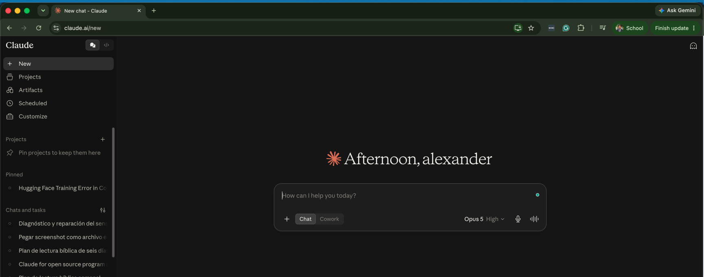{.nostretch width=76% fig-align="center"}

**Vive en el navegador** (miren la dirección: `claude.ai`). Como ChatGPT: ustedes **pegan** texto y él responde. Excelente tutor de conceptos — pero **no ve sus archivos**.

## 2 · Claude Cowork — la app de escritorio {.smaller}

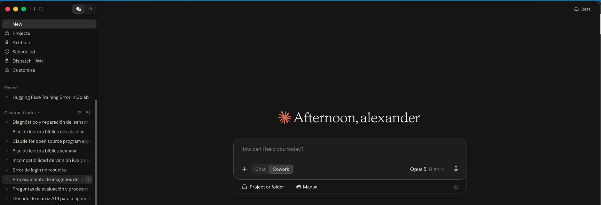{.nostretch width=68% fig-align="center"}

**Una app instalada, sin terminal** — noten abajo el botón **Select folder…** y la caja *"Describe a task"*: le señalan una carpeta y le describen la tarea, y el agente trabaja sobre esos archivos. Ideal para documentos — pero requiere **plan pago** ($20/mes o más).

## 3 · Claude Code — el del taller {.smaller}

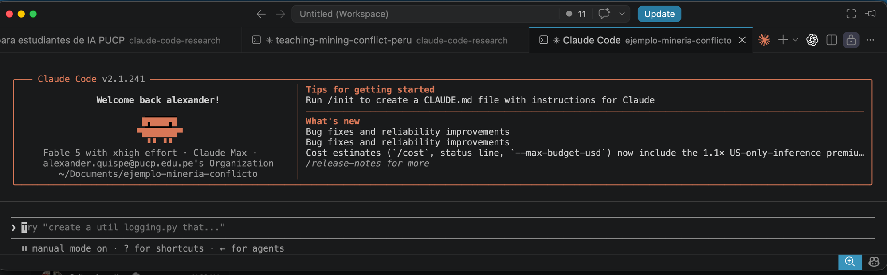{.nostretch width=90% fig-align="center"}

El mismo agente, en el **terminal de VS Code** — así lo verán hoy: la caja de bienvenida arriba, y abajo donde ustedes escriben. Ve sus archivos, ejecuta, verifica. Funciona con suscripción **o solo con una clave API** (paga por uso).

## ¿Cuál necesito yo? ¿Cuánto cuesta? {.smaller}

| Producto | ¿Para quién? | Acceso |
|----------|--------------|--------|
| **claude.ai** (el chat) | Preguntas, borradores, explicaciones | Gratis con límites · Pro **$20/mes** |
| **Claude Cowork** | Trabajo sobre documentos sin terminal | ❌ **Solo con plan pago** ($20/mes o más) |
| **Claude Code** | Investigación: datos, PDFs, LaTeX | ✅ Suscripción **o solo una clave API** (paga por uso) |

. . .

- El chat es como un **tutor**: excelente para que le expliquen un concepto (*"¿qué es diferencias en diferencias?"*).
- Claude Code es el **asistente de investigación**: trabaja sobre *sus* carpetas, *sus* datos, *sus* papers.
- Regla del taller: **usen el modelo Opus para todo**. Fable solo para redacción fina — es caro y se agota rápido.


## Así trabaja: el ciclo del agente {.smaller}

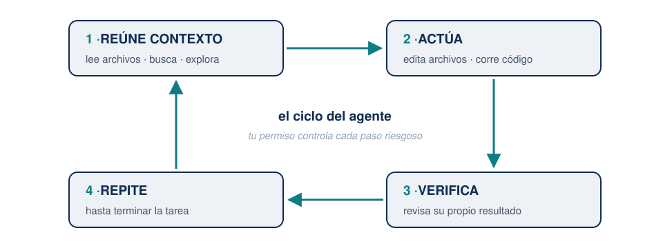{width=60% fig-align="center"}

- Cada acción pasa por herramientas: leer, editar, ejecutar, buscar.
- Cada acción riesgosa **pide su aprobación** primero.
- Usted es quien dirige la investigación; Claude es un asistente muy rápido.

# Bloque 2 — VS Code y el terminal

## ¿Por qué trabajamos en Visual Studio Code? {.smaller}

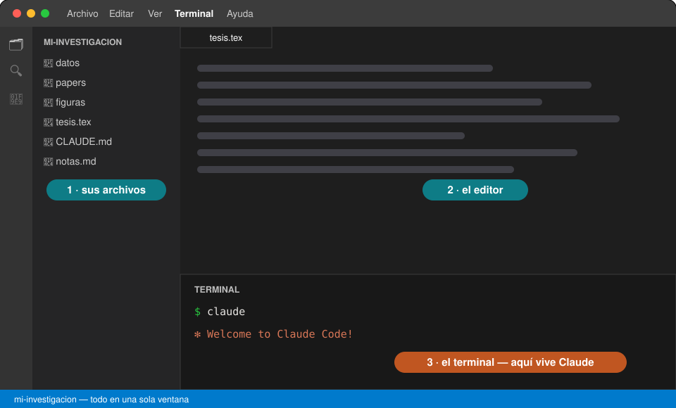{width=76% fig-align="center"}

**Todo en una sola ventana**: sus archivos a la izquierda, el documento al centro, y abajo el terminal donde vive Claude. Además es **gratis**, funciona igual en Windows y Mac, y abre PDFs, datos y texto sin cambiar de programa.

## Un plugin que necesitarán: vscode-pdf {.smaller}

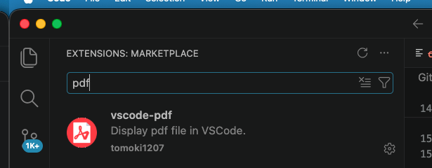{.nostretch width=72% fig-align="center"}

Para **leer PDFs dentro de VS Code** (sus papers, y el PDF que compile LaTeX):

1. Clic en el icono de **Extensiones** 🧩 de la barra izquierda
2. Buscar `pdf`
3. Instalar **vscode-pdf** (de *tomoki1207*) — un clic y listo

[Sin esto, cada PDF se abre en otro programa y pierden la gracia de "todo en una sola ventana".]{.small .muted}

## Traer su proyecto a VS Code {.smaller}

::: columns
::: {.column width="55%"}
Para el taller les enviaremos **la carpeta del proyecto** lista para descargar.

1. Descárguenla y colóquenla en **Documentos** (igual en Windows que en Mac)
2. En VS Code: menú **File → Add Folder to Workspace…**
3. Elijan la carpeta → aparece en el **panel izquierdo**

. . .

Con eso VS Code ya "ve" su proyecto: desde ese panel saldrá la ruta que le daremos al terminal en el siguiente paso.

[Este mismo camino sirve después para cualquier carpeta suya: tesis, cursos, papers.]{.small .muted}
:::
::: {.column width="45%"}
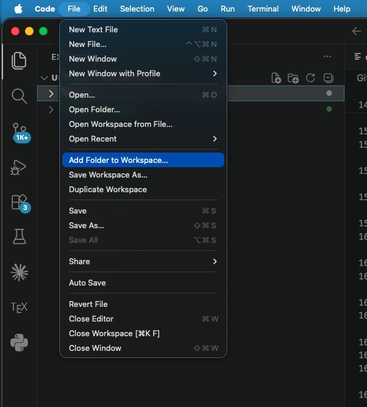{.nostretch width=88% fig-align="center"}
:::
:::

## Abrir el terminal: un solo clic {.smaller}

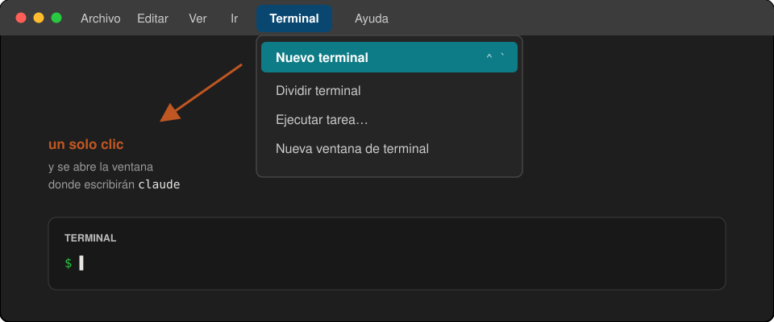{width=80% fig-align="center"}

Menú **Terminal → Nuevo terminal**. [Tip: si la ventanita de abajo les parece chica, repitan el menú y elijan *Nueva ventana de terminal* para tenerla grande y aparte.]{.small}

## ¿Qué es "el terminal"? (sin miedo)

Una ventana donde uno escribe **instrucciones en texto** en lugar de hacer clics.

. . .

La buena noticia de 2026:

- **No necesitan memorizar comandos** — Claude los escribe y ejecuta por ustedes.
- Ustedes solo necesitan **UNO**: `cd` (*change directory* = "cámbiate a esta carpeta").

. . .

¿Por qué uno solo? Porque lo único que ustedes hacen a mano es **decirle en qué carpeta trabajar**. Todo lo demás se pide conversando.

## Paso a paso: abrir Claude en su carpeta {.smaller}

1. Abran **VS Code** → menú **Terminal** → **New Terminal**.
   [Tip: si la ventanita de abajo les parece chica, repitan Terminal → *New Terminal Window* para tener una ventana grande aparte (a veces hay que abrir el terminal una vez para que aparezca esa opción).]{.small}
2. En el panel izquierdo de VS Code, busquen la **carpeta de su investigación** → clic derecho → **Copy Path**.
3. En el terminal escriban `cd`, un espacio, **peguen la ruta**, Enter.
4. Escriban `claude`, Enter.
5. Les preguntará si confían en esa carpeta → **Yes**.

. . .

```text
cd /Users/su-nombre/Documents/mi-investigacion
claude
```

[Ese es TODO el "código" que este taller les va a pedir escribir.]{.warm}

## 🧯 Kit de rescate — guarden este slide {.smaller}

Todos nos atascamos. Esto resuelve el 95 % de los líos:

| Problema | Solución |
|----------|----------|
| Claude está haciendo algo que no quiero | <kbd>Esc</kbd> — lo interrumpe sin romper nada |
| Quiero salir de Claude | <kbd>Ctrl</kbd>+<kbd>C</kbd> **dos veces** |
| Me metí a la carpeta equivocada | Salgan (Ctrl+C ×2), `cd` con la ruta correcta, `claude` de nuevo |
| Cerré todo, ¿perdí mi conversación? | No: `claude --resume` muestra sus conversaciones anteriores |
| Nada responde y no sé qué pasa | Cierren la ventana del terminal, abran una nueva y retomen |

. . .

::: {.callout-tip}
Y la herramienta universal: **tómenle captura de pantalla al problema, péguenla en Claude** (Ctrl+V / Cmd+V en el chat del terminal) y pregunten *"¿por qué me sale esto?"*. Claude se depura a sí mismo sorprendentemente bien.
:::

# Bloque 3 — Configuración y diagnóstico

## Antes de configurar: producto ≠ modelo {.smaller}

En el Bloque 1 eligieron el **producto**: Claude Code. Lo primero que van a configurar es el **modelo** — y es fácil confundirlos:

| | El producto | El modelo |
|---|---|---|
| **Qué es** | La puerta de entrada — *dónde* usan Claude | El cerebro que razona — *quién* les responde |
| **Los nombres** | claude.ai · Cowork · **Claude Code** | **Opus** · Fable · Sonnet · Haiku |
| **La analogía** | el vehículo | el motor |

. . .

Un mismo producto puede montar distintos motores — por eso dentro de Claude Code existe el menú `/model` para cambiar de cerebro.

[Así que no, "¿Opus es lo mismo que Claude Code?" — Claude Code es *desde dónde* trabajan; Opus es *quién* piensa.]{.warm}

## Elegir el modelo (una sola vez) {.smaller}

Dentro de Claude, escriban `/model` y elijan **Opus**.

| Modelo | ¿Cuándo? |
|--------|----------|
| **Opus** | ✅ Todo el trabajo del día a día: datos, tablas, LaTeX, organización |
| **Fable** | Solo redacción fina de un paper — es caro y el límite se agota en horas |
| Sonnet, Haiku | No los necesitan por ahora |

. . .

[Si un día algo responde "raro", lo primero que deben revisar es `/model`: ¿qué modelo quedó seleccionado?]{.small .muted}

## Así se ve el menú `/model` {.smaller}

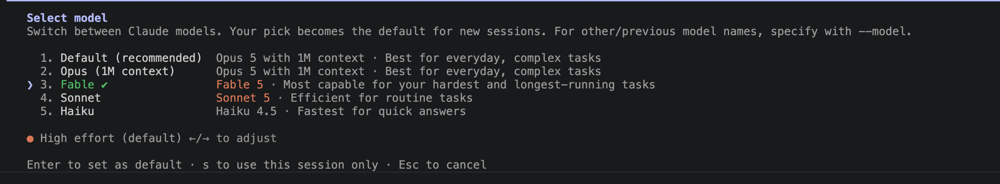{.nostretch width=92% fig-align="center"}

- Naveguen con ↑/↓ hasta **Opus (1M context)** y déjenlo con el **✓ verde**, como en la imagen. *Ese es el modelo del taller.*
- <kbd>Enter</kbd> lo fija como **default** para futuras sesiones · <kbd>s</kbd> lo usa **solo en esta sesión** · <kbd>Esc</kbd> cancela.
- ¿Y esa línea naranja de abajo, **"xHigh effort"**? → siguiente slide.

## ¿Qué significa "effort"? {.smaller}

El *effort* es **cuánto razona el modelo antes de responder** — como la diferencia entre pedirle a un asistente una respuesta al vuelo o un análisis cuidadoso.

| | Menos effort | Más effort |
|---|---|---|
| **Velocidad** | responde más rápido | piensa más tiempo |
| **Profundidad** | suficiente para tareas simples | mejor en problemas difíciles |
| **Consumo** | gasta menos | gasta más tokens |

. . .

- **Cómo se ajusta:** dentro del menú `/model`, con las flechas <kbd>←</kbd>/<kbd>→</kbd> — la línea naranja va cambiando: *low · medium · high · xHigh…*
- **Recomendación del taller: déjenlo en High o xHigh.** El modelo además adapta solo cuánto piensa según la dificultad de cada pedido.

## Los modos de trabajo (y el freno de mano) {.smaller}

Con <kbd>Shift</kbd>+<kbd>Tab</kbd> se cambia de modo — son **cuatro**, y se ven en la **barra de abajo** de Claude:

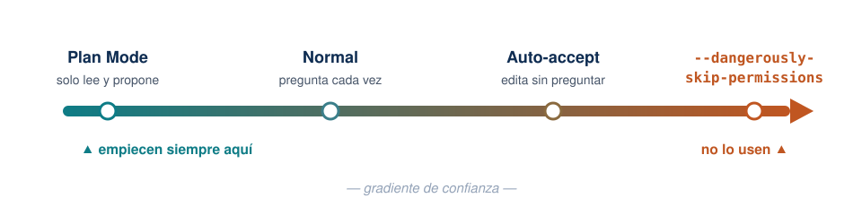{width=88% fig-align="center"}

- **plan mode on** — solo lee y **propone un plan**; no toca nada. *A fondo en la Sesión 2.*
- **manual mode on** — pregunta antes de **cada** acción.
- **accept edits on** — edita sin preguntar; los comandos aún piden permiso.
- **auto mode on** — ejecuta ediciones **y** comandos. **El modo de hoy.**

[Existe una bandera que desactiva todas las protecciones (`--dangerously-skip-permissions`) — no la usen.]{.small .muted}

## Así se ve en su terminal {.smaller}

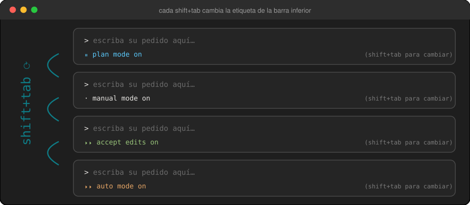{.nostretch width=74% fig-align="center"}

Presionen <kbd>Shift</kbd>+<kbd>Tab</kbd> varias veces ahora mismo y miren cómo **rota la etiqueta**. Déjenlo en **auto mode on**: así los ejercicios que siguen corren de corrido, sin detenerse en cada permiso.

## Último paso: la llave de la biblioteca {.your-turn .smaller}

Lo dejamos listo ahora para no perder tiempo después. En el navegador, abran esta dirección **tal cual** (es JSTOR a través del proxy):

```text
https://pucp.elogim.com/auth-meta/login.php?url=https://www.jstor.org
```

. . .

Les pedirá **usuario y contraseña del campus virtual** — los mismos de PAIDEIA/Intranet.
Y listo: **dejen esa pestaña abierta** el resto de la clase. El navegador quedó reconocido como PUCP.

. . .

**Para otra revista, cambian solo lo que va después de `url=`:**

```text
https://pucp.elogim.com/auth-meta/login.php?url=<dirección de la revista>
```

. . .

::: {.callout-important}
No se registran en JSTOR, ni en Wiley, ni en ninguna. **Su cuenta personal de JSTOR no sirve** — con ella solo pueden *leer en pantalla*. El botón de descarga aparece únicamente bajo la sesión de la Universidad.
:::

## Su turno: ¿qué me falta instalar? {.your-turn .smaller}

Con todo ya configurado, pídanle **literalmente esto**:

```text
Revisa mi entorno: dime qué versión tengo de Python y de LaTeX,
qué me falta instalar para trabajar con datos, PDFs y documentos
en este taller, y cómo instalarlo.
```

. . .

**Qué observar:** el agente **ejecuta comandos y les muestra qué hace**. No les contesta de memoria: está mirando *su* máquina.

::: {.callout-note}
Este ejercicio es a la vez el diagnóstico: si algo falta, el propio agente les dice cómo instalarlo — y puede instalarlo por ustedes. Es la primera lección de actitud: **cuando tengan una duda técnica, pregúntenle a Claude**.
:::

## Su turno: conozcan su computadora {.your-turn .smaller}

La mayoría no sabe qué máquina tiene — y a veces tiene más poder del que cree. Pregúntenle:

```text
¿Qué computadora tengo? Dime mi procesador (CPU), si tengo GPU o
aceleración para inteligencia artificial, y cuánta memoria RAM.
Con esas características, ¿qué herramientas de IA podría correr
localmente? Por ejemplo, ¿podría transcribir audio de mis clases
con Whisper, y qué tan rápido?
```

. . .

**Qué observar:** la respuesta es **distinta para cada persona** — Claude mira su hardware real y adapta la recomendación.

::: {.callout-tip}
Guarden esa respuesta: en la **Sesión 2** vamos a transcribir una clase grabada con Whisper, y la velocidad dependerá exactamente de esto (con GPU o chip moderno: minutos; solo CPU: más lento, pero funciona igual).
:::

# ☕ Pausa 1 — 10 minutos {background-color="#e6fbfc"}

[Volvemos 7:20 pm]{.big}

# Bloque 4 — Lo primero: `/init`

## Antes de pedirle nada: denle contexto {.smaller}

Podrían empezar a conversar de inmediato… pero Claude no sabe **nada** de su proyecto: qué contiene, cómo se organiza, qué reglas tiene.

. . .

Por eso el **primer comando de todo proyecto nuevo** es:

```text
/init
```

. . .

Claude **explora toda la carpeta** — lee sus documentos, sus datos, sus PDFs — y redacta un archivo llamado **`CLAUDE.md`** con lo que encontró: de qué trata el proyecto, cómo está organizado, qué convenciones sigue.

[Ese archivo se vuelve la **memoria del proyecto**: Claude lo lee automáticamente cada vez que inicien sesión ahí. Nunca más tendrán que volver a explicar de qué va su investigación.]{.warm}

## ¿Qué es un archivo markdown (`.md`)? {.smaller}

Es **texto simple con marcas de formato** — se abre con cualquier editor, pesa nada, y se lee igual dentro de 20 años.

| Lo que escriben | Lo que significa |
|---|---|
| `# Título` | encabezado |
| `## Subtítulo` | encabezado menor |
| `- punto` | viñeta |
| `**palabra**` | negrita |
| `` `código` `` | resaltar un comando o ruta |

. . .

**Por qué importa para ustedes:** es el formato en el que Claude guarda *todo* lo que quiere recordar — la memoria del proyecto, las notas de una reunión, un resumen de literatura. A diferencia de Word, es **legible tanto por ustedes como por la máquina**, y se puede versionar y comparar.

## Un `.md` abierto en VS Code {.smaller}

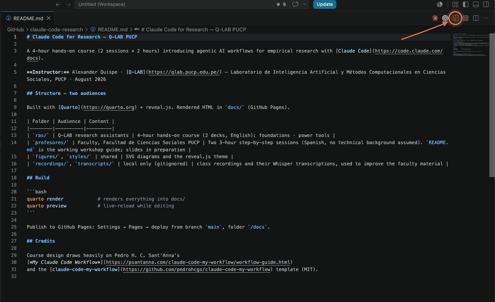{.nostretch width=86% fig-align="center"}

Así se ve **por dentro** — y no es un ejemplo inventado: es el `CLAUDE.md` del proyecto de hoy. Los `#`, `**` y las viñetas, a la vista. [▸ Clic en el **icono de la lupa** (arriba a la derecha, en el círculo) y VS Code lo lee por ustedes.]{.warm}

## …y así lo muestra VS Code {.smaller}

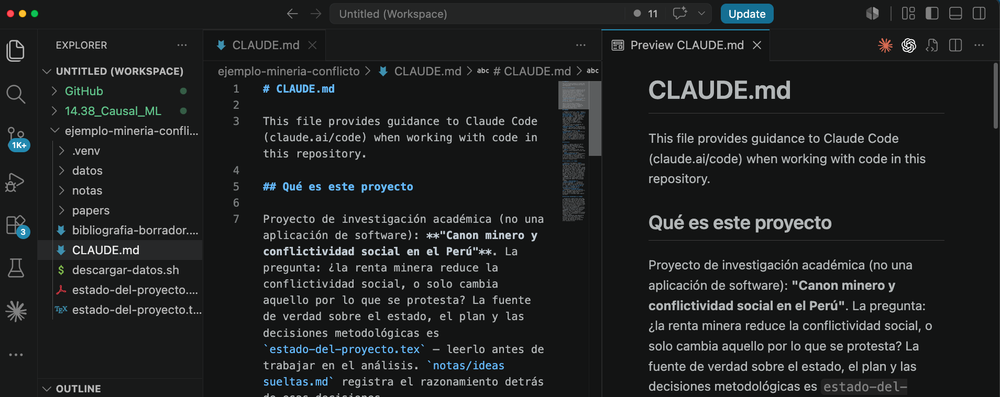{.nostretch width=86% fig-align="center"}

El mismo archivo, dos vistas: a la izquierda las marcas, a la derecha **el documento formateado**. Por eso markdown funciona tan bien con un agente — **él lo escribe, ustedes lo leen cómodo**.

## Su turno: `/init` en su proyecto {.your-turn .smaller}

```text
/init
```

Déjenlo trabajar (puede tomar un par de minutos: está leyendo todo).

. . .

Cuando termine, **ábranlo y léanlo**: `CLAUDE.md` aparece en el panel izquierdo de VS Code.

. . .

Después edítenlo como cualquier documento — agréguenle sus propias reglas:

```markdown
- Nunca modifiques los archivos de datos-originales/
- Las citas siempre en formato APA 7
- Respóndeme siempre en español
```

[**Qué observar:** entendió de qué trata su investigación sin que ustedes se lo dijeran.]{.warm}

## La memoria tiene niveles

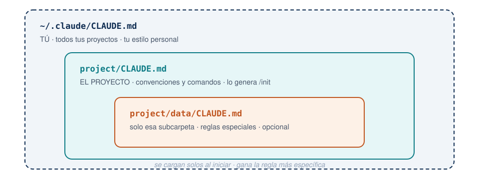{width=76% fig-align="center"}

[Ninguno existe por defecto: el del proyecto lo genera `/init`; el personal lo crean ustedes (o el atajo `#`); el de subcarpeta es opcional.]{.small .muted}

# Bloque 5 — Ahora sí: trabajar

## Su turno: la primera conversación {.your-turn .smaller}

Ya dentro de su carpeta real, prueben estas preguntas — **ninguna modifica nada**, solo leen:

```text
Dame un resumen de esta carpeta: ¿qué archivos hay y de qué trata?
```
```text
¿Qué archivos parecen versiones duplicadas o viejas?
```
```text
Explícale la estructura de esta carpeta a un nuevo asistente de
investigación, y publícala como una página para poder compartirla.
```

. . .

**Qué observar:** responde sobre **sus** archivos reales, citando nombres y contenidos — eso un chat de la web no puede hacerlo. Y el tercer prompt trae bonus: al ver "para compartirla", Claude carga uno de sus **skills** (manuales internos que activa cuando la tarea lo amerita — verán `⏺ Skill(artifact-design)` en el terminal) y publica la explicación como una **página web** (*Artifact*): enlace en claude.ai, **privado hasta que ustedes lo compartan**.

[Lo que antes era un Word adjunto para el nuevo asistente, ahora sale del terminal listo para enviar.]{.warm}

## El proyecto de ejemplo {.smaller}

De aquí en adelante trabajamos sobre una carpeta que les entregamos:
**`ejemplo-mineria-conflicto/`**. Es un proyecto de investigación real, a medio
empezar y **deliberadamente desordenado**.

> **La pregunta:** en los departamentos mineros del Perú, ¿la renta minera reduce
> la conflictividad social — o solo cambia **aquello por lo que se protesta**?

. . .

| Carpeta | Qué hay |
|---|---|
| `datos/` | 10 reportes de conflictos de la Defensoría · producción y empleo minero · mesas de diálogo · 251 proyectos de ley |
| `papers/` | 8 PDFs con nombres imposibles |
| `notas/` | Apuntes sueltos del investigador |

[Úsenla hoy y quédensela. Si prefieren, todos los ejercicios funcionan igual sobre una carpeta suya.]{.small .muted}

## Su turno 1 — identificar: los nombres {.your-turn .smaller}

Empecemos por saber **qué es cada archivo**. Miren `papers/`: hay cosas como
`descarga.pdf`, `el pasado importa - copia (2).pdf`, `articulo minería (1).pdf`.

```text
En la carpeta papers/ hay PDFs de artículos. Ábrelos y renómbralos con
el formato apellido-año-palabraclave.pdf. ANTES de renombrar nada,
muéstrame la lista de cambios que vas a hacer.
```

. . .

**Qué observar:**

1. **Pedir el plan antes de ejecutar** es el hábito de seguridad número uno.
2. El agente **lee el contenido del PDF** — no adivina por el nombre del archivo.
3. **Tres de esos papers no vienen al caso.** ¿Los detecta? Pregúntenle:
   *"¿cuáles de estos no tienen que ver con minería y conflicto en el Perú?"*

## Su turno 2 — archivar: la estructura {.your-turn .smaller}

Ya saben qué es cada cosa. Ahora **dónde va**:

```text
Quiero dejar este proyecto ordenado como un paquete de replicación
listo para enviar a una revista: carpetas claras (datos, código,
resultados, documento) y un README que explique cómo reproducir todo.

Propónme primero el plan — qué mueves y por qué. No cambies nada
todavía.
```

. . .

**Qué observar:** llega un plan concreto sobre *sus* archivos reales. Léanlo, cambien lo que no les guste, y recién entonces autoricen.

[Cuando terminen, pídanle que **actualice el `CLAUDE.md`** con la nueva estructura — así la memoria del proyecto queda al día.]{.small .muted}

# ☕ Pausa 2 — 10 minutos {background-color="#e6fbfc"}

[Volvemos 8:15 pm]{.big}

# Bloque 6 — La literatura: buscar, verificar y descargar

## Primero lo lanzamos, después conversamos {.your-turn .smaller}

`/deep-research` **tarda 15–20 minutos** — lo echamos a andar *ahora* y seguimos la clase mientras trabaja. Copien este prompt completo:

::: {.compact-code}
```text
/deep-research ¿Qué dice la evidencia empírica desde 2015 sobre la
relación entre actividad minera y conflictividad social en el Perú?
Prioriza estudios cuantitativos, revisiones sistemáticas e informes
oficiales.

Además del informe, hazme estas tres cosas:

1. Descarga a la carpeta papers/ todos los documentos de acceso
   abierto que cites (working papers, preprints, informes, tesis),
   nombrados apellido-año-tema.pdf y agrupados por subtema.

2. Crea un archivo pendientes.md con las fuentes relevantes que NO
   pudiste descargar — artículos en revistas por suscripción, libros
   y capítulos de libro. Para cada una incluye: cita completa en APA,
   DOI o ISBN, enlace al editor, y el motivo (suscripción, libro
   impreso, sin versión abierta disponible).

3. En el informe cita esas fuentes igual que las demás, pero
   márcalas como [pendiente de descarga].
```
:::

[Corre **en segundo plano**: la sesión les queda libre. Mírenlo con `/workflows`.]{.warm}

## ¿Por qué pedir también lo que *no* pudo bajar? {.smaller}

Porque en Ciencias Sociales **lo que queda fuera suele ser lo más citado**: el libro clásico de la disciplina, el artículo en una revista indexada de suscripción.

. . .

Si solo pidieran "descarga lo que encuentres", esas fuentes **desaparecerían silenciosamente** de su revisión — y una revisión de literatura con un hueco invisible es peor que una corta.

. . .

Con este prompt obtienen dos productos:

| Archivo | Qué contiene | Para qué |
|---|---|---|
| `papers/` | Los PDFs que sí consiguió | Leer y citar hoy mismo |
| `pendientes.md` | Cita completa, DOI/ISBN, enlace y motivo | **La lista de tareas** para la biblioteca PUCP |

[Volveremos a `pendientes.md` al final del bloque: es exactamente lo que el proxy de la biblioteca va a resolver.]{.warm}

## Lo que acaba de pasar por dentro {.smaller}

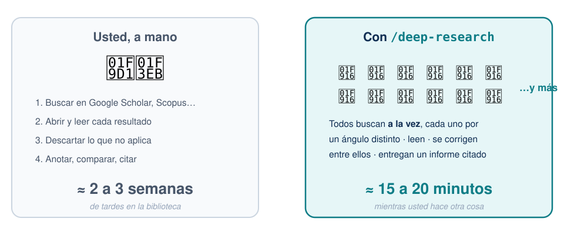{.nostretch width=80% fig-align="center"}

Una revisión que a un asistente le tomaría **dos o tres semanas**, un equipo de agentes en paralelo la entrega **en lo que dura este bloque**. No es magia: es que son **muchos, a la vez** — y mientras trabajan, ustedes siguen con lo suyo.

## No es una búsqueda: es un equipo {.smaller}

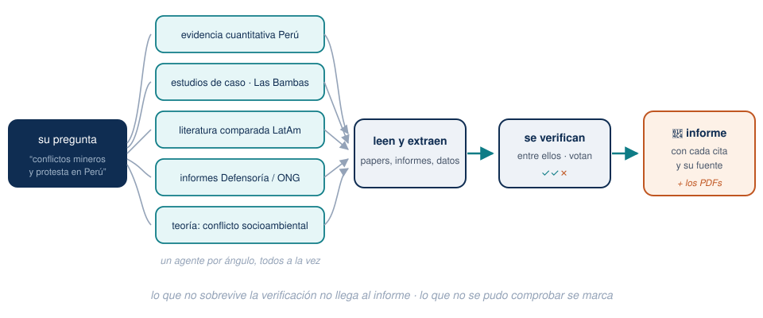{.nostretch width=70% fig-align="center"}

Su pregunta se repartió en **cinco ángulos**; cada agente busca por el suyo, leen y extraen, y **se verifican entre ellos** antes de escribir el informe. Es la estructura de un seminario de investigación, no la de un buscador.

. . .

**¿Y cuántos son?** Dos números que no hay que confundir: **a la vez** corren hasta **16 en paralelo**; **en total**, a lo largo de la corrida, entran **cientos** por fases — en una corrida real de este taller, cerca de **100**. [El tamaño se regula con `/config workflowSizeGuideline`: `small` <5 · **`medium` <15 (por defecto)** · `large` <50.]{.small .muted}

## Por qué esto importa para la verificación {.smaller}

Un buscador les da **enlaces**. Este equipo les da **afirmaciones ya contrastadas**:

- Cada agente busca por un **ángulo distinto** — nadie depende de una sola consulta afortunada.
- Los agentes **se revisan entre ellos**: lo que un agente afirma, otros lo verifican contra la fuente.
- Lo que **no sobrevive** esa votación **no llega al informe**; lo que no se pudo comprobar aparece marcado como *no verificado*.

. . .

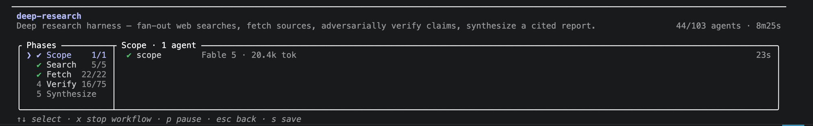{.nostretch width=100% fig-align="center"}

[Captura de `/workflows` en una corrida real: fases Scope → Search → Fetch → **Verify** → Synthesize. Miren la fase Verify: **75 agentes** dedicados solo a comprobar lo que afirmaron los demás.]{.small}

::: {.callout-tip}
Empiecen a leer el informe **por lo marcado como no verificado**: ahí es donde su criterio de investigador hace la diferencia.
:::

## ⭐ De vuelta al informe: verifiquen {.your-turn .smaller}

Ya debe haber terminado. Ábranlo… y **antes de usar una sola cita**, pídanle esto:

```text
De la bibliografía que armaste, verifica cada referencia contra
Crossref: autores, año, título, volumen, páginas y DOI. Dime cuáles
tienen algún dato que no coincide y cuál es el correcto.
No me digas que está bien si no la pudiste comprobar.
```

. . .

**Qué observar:** el informe ya venía con la fuente de cada afirmación — **y la verificación igual encuentra cosas**. Un DOI roto lo detecta cualquiera al primer clic; uno que abre el paper equivocado sobrevive a la revisión por pares.

. . .

::: {.callout-important}
## La lección central del taller
**Recordar** y **verificar** son dos modos distintos de trabajo, y el segundo **hay que pedirlo explícitamente**. Todo lo que vaya a una publicación de ustedes pasa por el modo verificar.
:::

## El límite: qué puede y qué no puede descargar {.smaller}

| Tipo de fuente | ¿Lo consigue solo? |
|---|---|
| Working papers (NBER, SSRN, RePEc), preprints (arXiv) | ✅ Sí |
| Informes oficiales, tesis, repositorios institucionales | ✅ Sí |
| **Artículos publicados en revistas de suscripción** | ❌ **No** — llega al resumen, no al PDF |
| **Libros** | ❌ No — y en Ciencias Sociales muchas veces el libro *es* la fuente |

. . .

[No es un defecto de la herramienta: es que **esas puertas están cerradas para cualquiera que no esté logueado**. Y ustedes sí lo están.]{.warm}

## La solución: un solo login {.smaller}

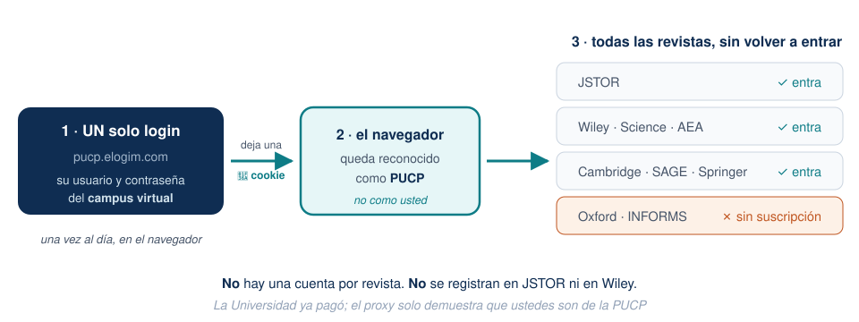{.nostretch width=84% fig-align="center"}

**Un** login — el del proxy de la biblioteca, con sus credenciales del campus virtual — y el navegador queda reconocido como PUCP: **todas** las revistas suscritas abren sin ingresar nada más. Ya lo hicieron al inicio de la clase; esa pestaña abierta es la llave.

## ¿Y por qué `/deep-research` no usó esa sesión? {.smaller}

Ustedes se loguearon al inicio de la clase… y aun así el informe dejó pendientes. No es un error:

::: {.callout-important}
Los agentes de `/deep-research` **no navegan desde su computadora**: buscan y leen desde los servidores de Anthropic. Por eso **no ven la cookie de su navegador** — para ellos, esas revistas siguen cerradas.
:::

. . .

De ahí el reparto de tareas que ya conocen, ahora con nombre técnico:

| Quién | Qué hace | Con qué |
|---|---|---|
| **Los agentes** | Encuentran todo y bajan lo abierto; listan el resto | Búsqueda web, sin sesión |
| **Su navegador** | Descarga lo suscrito | La sesión PUCP que abrieron |

[Por eso `pendientes.md` no es un consuelo: es **el puente** entre las dos mitades.]{.warm}

## Que él prepare, ustedes hagan clic {.your-turn .smaller}

Claude **no puede descargar de la biblioteca por ustedes** — no tiene su sesión. Pero sí puede dejarles el trabajo servido:

```text
Toma pendientes.md y arma una lista donde cada fuente tenga su enlace
de descarga ya armado con el proxy de la biblioteca, con este formato:
https://pucp.elogim.com/auth-meta/login.php?url=<enlace al artículo>

Ordénalas de más a menos citada y guárdala como descargar.md.
```

. . .

Entonces ustedes: **clic en cada enlace → descargar → todo a `papers/`**. Con la sesión ya abierta, son segundos por artículo.

. . .

Y al terminar, se lo devuelven:

```text
Ya descargué los PDFs a papers/. Renómbralos con el formato
apellido-año-tema.pdf, verifica que cada uno corresponda a su cita,
y actualiza pendientes.md con los que siguen faltando.
```

## El reparto de tareas, otra vez {.smaller}

Es el mismo principio de siempre, y conviene que quede grabado:

| Ustedes | Claude |
|---|---|
| Se loguean · hacen clic · descargan | Busca · arma los enlaces · organiza · renombra · verifica |

. . .

**Por qué es así:** Claude nunca escribe contraseñas por ustedes — regla de seguridad — y, trabajando con **clave API**, tampoco puede manejar su navegador.

. . .

::: {.callout-note}
## ¿Y no hay forma de que él haga hasta los clics?
La hay: la extensión **Claude in Chrome** le permite operar su navegador ya logueado — con ella, la descarga de `pendientes.md` sí sería automática. Pero **requiere suscripción paga** (Pro, $20/mes o más); **no funciona con la clave API** con la que trabajamos hoy.
:::

::: {.callout-tip}
Aun así el ahorro es enorme: la parte lenta no era hacer clic, era **saber qué buscar, dónde está y si la cita es correcta**.
:::

[Que la página cargue no significa que haya suscripción — hay que llegar hasta el PDF. Comprobado que **no** tenemos: Oxford ni Management Science/INFORMS (o sea, ni QJE ni ReStud por esta vía).]{.small .muted}

## El broche: la revisión, en LaTeX y en PDF {.your-turn .smaller}

Todo lo del bloque converge aquí. Pídanle:

```text
Con el informe de deep-research y los PDFs de papers/, escribe la
sección "Revisión de la literatura" de mi paper: 3 a 4 páginas,
organizada por temas (no paper por paper), con citas autor-año
y su archivo referencias.bib.

Créala como documento LaTeX independiente (revision-literatura.tex),
compílala a PDF y ábreme el resultado. Si la compilación falla,
lee el error, corrige y reintenta hasta que salga.
```

. . .

**Qué observar:**

1. **Ustedes no escribieron ni una línea de LaTeX** — la promesa del Bloque 1, cumplida. Si la compilación falla, él lee el error y se corrige solo: es el ciclo del agente.
2. El PDF se abre **dentro de VS Code** — para eso instalaron vscode-pdf.
3. [Es un **borrador para su edición**: la estructura y las citas ya están (y verificadas); la voz y el argumento los ponen ustedes.]{.warm}

# Bloque 7 — Cierre

## Lo que ya saben hacer {.smaller}

- Distinguir el chat, Cowork y **Claude Code** — y qué cuesta cada uno.
- Moverse en VS Code y abrir el terminal con un clic.
- Abrir Claude en su carpeta con el único comando necesario (`cd`).
- El kit de rescate: <kbd>Esc</kbd>, <kbd>Ctrl</kbd>+<kbd>C</kbd> ×2, `claude --resume`.
- Darle memoria al proyecto con `/init` + `CLAUDE.md`.
- **La lección central: memoria ≠ verificación.** Pidan verificar, siempre.
- Descargar de la biblioteca PUCP con el patrón "yo me logueo, él opera".

## Tarea para la próxima sesión {.your-turn .smaller}

Elijan **una tarea real y pequeña** de su propia investigación:

1. Corran `/init` en la carpeta de un proyecto suyo y **lean** el `CLAUDE.md` que genera. Corrijan lo que no le gustó.
2. Pídanle que ordene y renombre una carpeta de PDFs acumulados — **con plan previo**.
3. Verifiquen la bibliografía de algo que estén escribiendo: *"revisa cada cita de este documento contra Crossref y dime cuáles tienen errores"*.

. . .

**Próxima sesión:** el flujo completo de investigación — revisión de literatura automática con `/deep-research`, dashboards de datos, LaTeX sin escribir LaTeX, y cómo convertir sus clases grabadas en material de trabajo.

## Referencias {.smaller}

- Guía escrita de este taller (guion + manual): carpeta `profesores/` del repositorio del curso
- Sant'Anna, P. H. C. — *My Claude Code Workflow*: [psantanna.com/claude-code-my-workflow](https://psantanna.com/claude-code-my-workflow/workflow-guide.html)
- Documentación oficial: [code.claude.com/docs](https://code.claude.com/docs)
- Biblioteca PUCP: [biblioteca.pucp.edu.pe](https://biblioteca.pucp.edu.pe)

[Estos slides fueron escritos, diagramados y compilados con Claude Code — incluyendo el análisis de las grabaciones de las clases piloto con los asistentes del Q-LAB.]{.small .muted}

# Anexo — por si surge en preguntas

## Cuando de verdad no hay acceso {.smaller}

Casi siempre existe una versión abierta: **NBER · SSRN · arXiv · RePEc**, el repositorio del autor, o el enlace [PDF] a la derecha en Google Scholar.

::: {.callout-warning}
El *working paper* **no es** el artículo publicado — hay casos con distinto título y hasta distintos autores. Para **citar**, la versión publicada; para leer, cualquiera — sabiendo cuál tienen.
:::

. . .

Y para libros, que es lo que más pesa en varias de sus disciplinas: la búsqueda en el **catálogo de la biblioteca** sigue siendo insustituible. Esta herramienta **complementa**, no reemplaza.

## ¿Se puede acortar la espera? {.smaller}

**No hay un parámetro de tiempo** — pero sí tres palancas reales:

| Palanca | Cómo |
|---|---|
| **Menos agentes** | `/config workflowSizeGuideline=small` → apunta a menos de 5 agentes (por defecto son hasta 15) |
| **Pregunta más estrecha** | Un periodo, un país, un tipo de fuente. Una pregunta amplia abre más frentes y tarda más |
| **Cortarlo a mano** | `/workflows` → seleccionar la corrida → <kbd>x</kbd> detiene · <kbd>p</kbd> pausa y reanuda |

. . .

- En `/workflows` ven **en vivo** cuántos agentes hay, cuántos tokens llevan y el tiempo transcurrido.
- Si una corrida se dispara (más de 25 agentes), Claude Code muestra un aviso de **corrida grande**.

[La estrategia práctica es la de hoy: **lánzenlo y sigan trabajando**. No es tiempo perdido si ustedes no lo están mirando.]{.warm}
