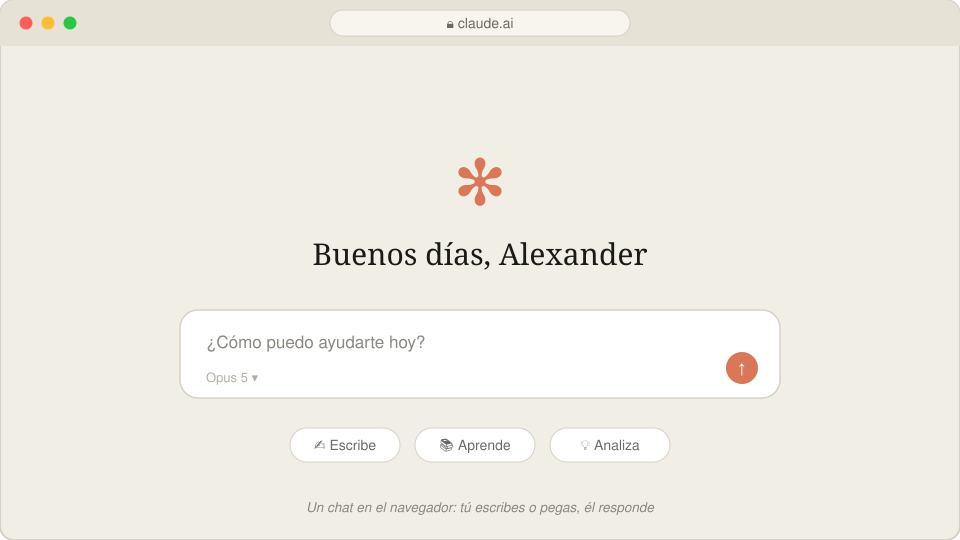
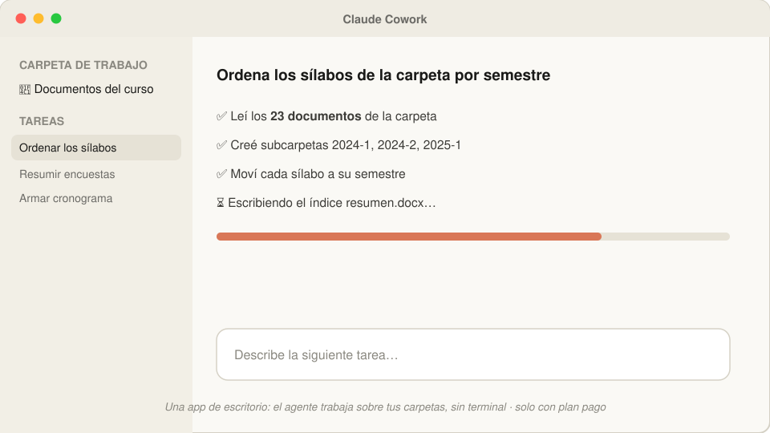
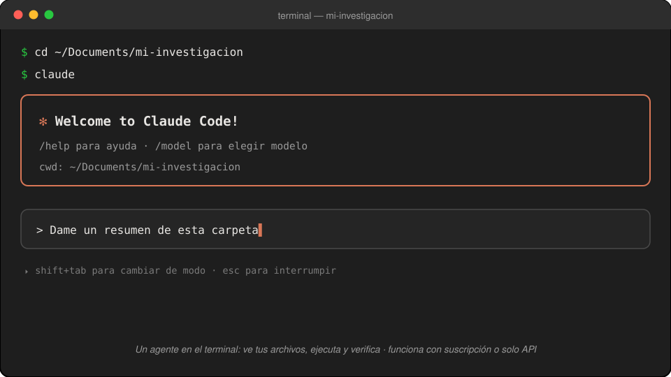

## Plan de hoy (3 horas) {.smaller}

| Hora | Bloque | Tema |
|------|--------|------|
| 6:00 – 6:20 | 1 | Qué es Claude y sus tres productos |
| 6:20 – 6:50 | 2 | VS Code y el terminal, paso a paso |
| 6:50 – 7:10 | 3 | Diagnóstico, modelo y modos de trabajo |
| 7:10 – 7:20 | ☕ | Pausa 1 |
| 7:20 – 7:40 | 4 | Primeras conversaciones con sus archivos |
| 7:40 – 8:05 | 5 | La memoria del proyecto: `/init` |
| 8:05 – 8:15 | ☕ | Pausa 2 |
| 8:15 – 8:45 | 6 | ⭐ La trampa de la cita |
| 8:45 – 8:55 | 7 | La biblioteca PUCP |
| 8:55 – 9:00 | 8 | Cierre y tarea |

[Los asistentes del Q-LAB están en la sala: levanten la mano ante cualquier problema técnico y ellos los ayudan sin detener la clase.]{.small .muted}

# Bloque 1 — Qué es Claude

## Claude Code, en una frase

> Un agente que vive en su computadora, **ve sus archivos** y puede
> **trabajar sobre ellos** por usted.

. . .

No es un chat al que le pegan texto. La diferencia práctica:

| En el chat de siempre | Con Claude Code |
|---|---|
| "Resúmeme este paper" *(y usted pega el texto)* | "Lee los **40 PDF de esta carpeta**, dime cuáles usan datos de panel y arma una tabla" |
| Usted copia la respuesta a Word | Él **crea y edita los archivos** directamente |

## ¿Para qué les sirve, concretamente? {.smaller}

En su semana de investigación y docencia, Claude Code puede:

- **Verificar la bibliografía** de un artículo, cita por cita, contra Crossref
- **Ordenar y renombrar** esa carpeta de PDFs acumulados de años
- **Extraer una tabla** de un PDF a Excel — o de 40 PDFs a una sola tabla
- **Escribir y compilar** documentos y slides en LaTeX, sin que ustedes sepan LaTeX
- **Explorar una base de datos** y devolver estadísticas y gráficos

. . .

::: {.callout-tip}
## Nada de eso requiere saber programar
Sí requiere saber **qué pedirle y cómo verificarlo** — de eso trata este taller.
:::

## Un mismo cerebro, tres productos

Antes de instalar nada, ubíquense: **Claude son tres cosas distintas** y es fácil confundirlas. Veámoslas una por una.

. . .

1. **claude.ai** — el chat en el navegador *(este seguro ya lo conocen)*
2. **Claude Cowork** — una app de escritorio para trabajar sobre carpetas
3. **Claude Code** — el agente en el terminal *(el de este taller)*

## 1 · claude.ai — el chat {.smaller}

{.nostretch width=64% fig-align="center"}

Como ChatGPT: ustedes **pegan** texto y él responde. Excelente tutor de conceptos — pero **no ve sus archivos**.

## 2 · Claude Cowork — la app de escritorio {.smaller}

{.nostretch width=64% fig-align="center"}

El agente trabaja sobre una carpeta, **sin terminal**. Ideal para tareas de documentos — pero requiere **plan pago** ($20/mes o más).

## 3 · Claude Code — el del taller {.smaller}

{.nostretch width=64% fig-align="center"}

El mismo agente, en el **terminal**: ve sus archivos, ejecuta, verifica. Funciona con suscripción **o solo con una clave API** (paga por uso).

## ¿Cuál necesito yo? ¿Cuánto cuesta? {.smaller}

| Producto | ¿Para quién? | Acceso |
|----------|--------------|--------|
| **claude.ai** (el chat) | Preguntas, borradores, explicaciones | Gratis con límites · Pro **$20/mes** |
| **Claude Cowork** | Trabajo sobre documentos sin terminal | ❌ **Solo con plan pago** ($20/mes o más) |
| **Claude Code** | Investigación: datos, PDFs, LaTeX | ✅ Suscripción **o solo una clave API** (paga por uso) |

. . .

- El chat es como un **tutor**: excelente para que le expliquen un concepto (*"¿qué es diferencias en diferencias?"*).
- Claude Code es el **asistente de investigación**: trabaja sobre *sus* carpetas, *sus* datos, *sus* papers.
- Regla del taller: **usen el modelo Opus para todo**. Fable solo para redacción fina — es caro y se agota rápido.


## Así trabaja: el ciclo del agente {.smaller}

{width=60% fig-align="center"}

- Cada acción pasa por herramientas: leer, editar, ejecutar, buscar.
- Cada acción riesgosa **pide su aprobación** primero.
- Usted es quien dirige la investigación; Claude es un asistente muy rápido.

# Bloque 2 — VS Code y el terminal

## ¿Por qué trabajamos en Visual Studio Code? {.smaller}

{width=76% fig-align="center"}

**Todo en una sola ventana**: sus archivos a la izquierda, el documento al centro, y abajo el terminal donde vive Claude. Además es **gratis**, funciona igual en Windows y Mac, y abre PDFs, datos y texto sin cambiar de programa.

## Un plugin que necesitarán: vscode-pdf {.smaller}

{.nostretch width=72% fig-align="center"}

Para **leer PDFs dentro de VS Code** (sus papers, y el PDF que compile LaTeX):

1. Clic en el icono de **Extensiones** 🧩 de la barra izquierda
2. Buscar `pdf`
3. Instalar **vscode-pdf** (de *tomoki1207*) — un clic y listo

[Sin esto, cada PDF se abre en otro programa y pierden la gracia de "todo en una sola ventana".]{.small .muted}

## Traer su proyecto a VS Code {.smaller}

::: columns
::: {.column width="55%"}
Para el taller les enviaremos **la carpeta del proyecto** lista para descargar.

1. Descárguenla y colóquenla en **Documentos** (igual en Windows que en Mac)
2. En VS Code: menú **File → Add Folder to Workspace…**
3. Elijan la carpeta → aparece en el **panel izquierdo**

. . .

Con eso VS Code ya "ve" su proyecto: desde ese panel saldrá la ruta que le daremos al terminal en el siguiente paso.

[Este mismo camino sirve después para cualquier carpeta suya: tesis, cursos, papers.]{.small .muted}
:::
::: {.column width="45%"}
{.nostretch width=88% fig-align="center"}
:::
:::

## Abrir el terminal: un solo clic {.smaller}

{width=80% fig-align="center"}

Menú **Terminal → Nuevo terminal**. [Tip: si la ventanita de abajo les parece chica, repitan el menú y elijan *Nueva ventana de terminal* para tenerla grande y aparte.]{.small}

## ¿Qué es "el terminal"? (sin miedo)

Una ventana donde uno escribe **instrucciones en texto** en lugar de hacer clics.

. . .

La buena noticia de 2026:

- **No necesitan memorizar comandos** — Claude los escribe y ejecuta por ustedes.
- Ustedes solo necesitan **UNO**: `cd` (*change directory* = "cámbiate a esta carpeta").

. . .

¿Por qué uno solo? Porque lo único que ustedes hacen a mano es **decirle en qué carpeta trabajar**. Todo lo demás se pide conversando.

## Paso a paso: abrir Claude en su carpeta {.smaller}

1. Abran **VS Code** → menú **Terminal** → **New Terminal**.
   [Tip: si la ventanita de abajo les parece chica, repitan Terminal → *New Terminal Window* para tener una ventana grande aparte (a veces hay que abrir el terminal una vez para que aparezca esa opción).]{.small}
2. En el panel izquierdo de VS Code, busquen la **carpeta de su investigación** → clic derecho → **Copy Path**.
3. En el terminal escriban `cd`, un espacio, **peguen la ruta**, Enter.
4. Escriban `claude`, Enter.
5. Les preguntará si confían en esa carpeta → **Yes**.

. . .

```text
cd /Users/su-nombre/Documents/mi-investigacion
claude
```

[Ese es TODO el "código" que este taller les va a pedir escribir.]{.warm}

## 🧯 Kit de rescate — guarden este slide {.smaller}

Todos nos atascamos. Esto resuelve el 95 % de los líos:

| Problema | Solución |
|----------|----------|
| Claude está haciendo algo que no quiero | <kbd>Esc</kbd> — lo interrumpe sin romper nada |
| Quiero salir de Claude | <kbd>Ctrl</kbd>+<kbd>C</kbd> **dos veces** |
| Me metí a la carpeta equivocada | Salgan (Ctrl+C ×2), `cd` con la ruta correcta, `claude` de nuevo |
| Cerré todo, ¿perdí mi conversación? | No: `claude --resume` muestra sus conversaciones anteriores |
| Nada responde y no sé qué pasa | Cierren la ventana del terminal, abran una nueva y retomen |

. . .

::: {.callout-tip}
Y la herramienta universal: **tómenle captura de pantalla al problema, péguenla en Claude** (Ctrl+V / Cmd+V en el chat del terminal) y pregunten *"¿por qué me sale esto?"*. Claude se depura a sí mismo sorprendentemente bien.
:::

# Bloque 3 — Diagnóstico y configuración

## Su turno: el primer ejercicio {.your-turn}

Ya están dentro de Claude, en su carpeta. Pídanle **literalmente esto**:

```text
Revisa mi entorno: dime qué versión tengo de Python y de LaTeX,
qué me falta instalar para trabajar con datos, PDFs y documentos
en este taller, y cómo instalarlo.
```

. . .

**Qué observar:** el agente **ejecuta comandos y les muestra qué hace**. No les contesta de memoria: está mirando *su* máquina.

::: {.callout-note}
Este ejercicio es a la vez el diagnóstico: si algo falta, el propio agente les dice cómo instalarlo — y puede instalarlo por ustedes. Es la primera lección de actitud: **cuando tengan una duda técnica, pregúntenle a Claude**.
:::

## Su turno: conozcan su computadora {.your-turn .smaller}

La mayoría no sabe qué máquina tiene — y a veces tiene más poder del que cree. Pregúntenle:

```text
¿Qué computadora tengo? Dime mi procesador (CPU), si tengo GPU o
aceleración para inteligencia artificial, y cuánta memoria RAM.
Con esas características, ¿qué herramientas de IA podría correr
localmente? Por ejemplo, ¿podría transcribir audio de mis clases
con Whisper, y qué tan rápido?
```

. . .

**Qué observar:** la respuesta es **distinta para cada persona** — Claude mira su hardware real y adapta la recomendación.

::: {.callout-tip}
Guarden esa respuesta: en la **Sesión 2** vamos a transcribir una clase grabada con Whisper, y la velocidad dependerá exactamente de esto (con GPU o chip moderno: minutos; solo CPU: más lento, pero funciona igual).
:::

## Elegir el modelo (una sola vez) {.smaller}

Dentro de Claude, escriban `/model` y elijan **Opus**.

| Modelo | ¿Cuándo? |
|--------|----------|
| **Opus** | ✅ Todo el trabajo del día a día: datos, tablas, LaTeX, organización |
| **Fable** | Solo redacción fina de un paper — es caro y el límite se agota en horas |
| Sonnet, Haiku | No los necesitan por ahora |

. . .

[Si un día algo responde "raro", lo primero que deben revisar es `/model`: ¿qué modelo quedó seleccionado?]{.small .muted}

## Así se ve el menú `/model` {.smaller}

{.nostretch width=92% fig-align="center"}

- Naveguen con ↑/↓ hasta **Opus (1M context)** y déjenlo con el **✓ verde**, como en la imagen. *Ese es el modelo del taller.*
- <kbd>Enter</kbd> lo fija como **default** para futuras sesiones · <kbd>s</kbd> lo usa **solo en esta sesión** · <kbd>Esc</kbd> cancela.
- ¿Y esa línea naranja de abajo, **"xHigh effort"**? → siguiente slide.

## ¿Qué significa "effort"? {.smaller}

El *effort* es **cuánto razona el modelo antes de responder** — como la diferencia entre pedirle a un asistente una respuesta al vuelo o un análisis cuidadoso.

| | Menos effort | Más effort |
|---|---|---|
| **Velocidad** | responde más rápido | piensa más tiempo |
| **Profundidad** | suficiente para tareas simples | mejor en problemas difíciles |
| **Consumo** | gasta menos | gasta más tokens |

. . .

- **Cómo se ajusta:** dentro del menú `/model`, con las flechas <kbd>←</kbd>/<kbd>→</kbd> — la línea naranja va cambiando: *low · medium · high · xHigh…*
- **Recomendación del taller: déjenlo en High o xHigh.** El modelo además adapta solo cuánto piensa según la dificultad de cada pedido.

## Los modos de trabajo (y el freno de mano) {.smaller}

Con <kbd>Shift</kbd>+<kbd>Tab</kbd> se cambia de modo — son **cuatro**, y se ven en la **barra de abajo** de Claude:

{width=88% fig-align="center"}

- **plan mode on** — solo lee y **propone un plan**; no toca nada. Para empezar cualquier cosa nueva. *Lo usaremos a fondo en la Sesión 2.*
- **manual mode on** — pregunta antes de **cada** acción.
- **accept edits on** — edita archivos sin preguntar; los comandos aún piden permiso.
- **auto mode on** — ejecuta ediciones **y** comandos solo. **El modo que usaremos hoy**, para que los ejercicios fluyan.

[Existe además una bandera de arranque que desactiva todas las protecciones (`--dangerously-skip-permissions`) — no la usen.]{.small .muted}

## Así se ve en su terminal {.smaller}

{.nostretch width=74% fig-align="center"}

Presionen <kbd>Shift</kbd>+<kbd>Tab</kbd> varias veces ahora mismo y miren cómo **rota la etiqueta**. Déjenlo en **auto mode on**: así los ejercicios que siguen corren de corrido, sin detenerse en cada permiso.

# ☕ Pausa 1 — 10 minutos {background-color="#e6fbfc"}

[Volvemos 7:20 pm]{.big}

# Bloque 4 — Primeras conversaciones

## Su turno: la primera conversación {.your-turn}

Ya dentro de su carpeta real, prueben estas preguntas — **ninguna modifica nada**, solo leen:

```text
Dame un resumen de esta carpeta: ¿qué archivos hay y de qué trata?
```
```text
¿Qué archivos parecen versiones duplicadas o viejas?
```
```text
Explícale la estructura de esta carpeta a un nuevo asistente
de investigación.
```

. . .

**Qué observar:** responde sobre **sus** archivos reales, citando nombres y contenidos. Eso es lo que un chat de la web no puede hacer.

## El proyecto de ejemplo {.smaller}

De aquí en adelante trabajamos sobre una carpeta que les entregamos:
**`ejemplo-mineria-conflicto/`**. Es un proyecto de investigación real, a medio
empezar y **deliberadamente desordenado**.

> **La pregunta:** en los departamentos mineros del Perú, ¿la renta minera reduce
> la conflictividad social — o solo cambia **aquello por lo que se protesta**?

. . .

| Carpeta | Qué hay |
|---|---|
| `datos/` | 10 reportes de conflictos de la Defensoría · producción y empleo minero · mesas de diálogo · 251 proyectos de ley |
| `papers/` | 8 PDFs con nombres imposibles |
| `bibliografia-borrador.md` | Una bibliografía hecha a las apuradas |
| `notas/` | Apuntes sueltos del investigador |

[Úsenla hoy y quédensela. Si prefieren, todos los ejercicios funcionan igual sobre una carpeta suya.]{.small .muted}

## Su turno: poner orden (con plan previo) {.your-turn .smaller}

El ejercicio favorito de todos. Miren primero `papers/`: hay cosas como
`descarga.pdf`, `el pasado importa - copia (2).pdf`, `articulo minería (1).pdf`.

```text
En la carpeta papers/ hay PDFs de artículos. Ábrelos y renómbralos con
el formato apellido-año-palabraclave.pdf. ANTES de renombrar nada,
muéstrame la lista de cambios que vas a hacer.
```

. . .

**Qué observar:**

1. **Pedir el plan antes de ejecutar** es el hábito de seguridad número uno.
2. El agente **lee el contenido del PDF** — no adivina por el nombre del archivo.
3. **Tres de esos papers no vienen al caso.** ¿Los detecta? Pregúntenle:
   *"¿cuáles de estos no tienen que ver con minería y conflicto en el Perú?"*

# Bloque 5 — La memoria del proyecto

## El problema: cada sesión empieza de cero {.smaller}

Mañana abren Claude y ya no recuerda:

- que su proyecto usa datos de la ENAHO y no se tocan los originales,
- que ustedes escriben en español y citan en APA,
- de qué trata la investigación.

. . .

**La solución:** un archivo llamado `CLAUDE.md` en la carpeta del proyecto, que Claude **lee automáticamente al iniciar**.

::: {.callout-note}
## ¿"`.md`"? — su primer archivo markdown
Markdown es solo **texto simple con formato ligero** (títulos con `#`, listas con `-`). Se abre con cualquier editor. No hay que aprenderlo: Claude lo escribe; ustedes lo leen y corrigen.
:::

## `/init`: que él lo escriba

Dentro de Claude, escriban:

```text
/init
```

. . .

Claude **explora toda la carpeta** — lee sus documentos, sus datos, sus PDFs — y redacta el `CLAUDE.md` por ustedes: de qué trata el proyecto, cómo está organizado, qué convenciones sigue.

. . .

Después ustedes lo **editan como cualquier documento**: agregan reglas suyas, por ejemplo:

```markdown
- Nunca modifiques los archivos de la carpeta datos-originales/
- Las citas siempre en formato APA 7
- Respóndeme siempre en español
```

## La memoria tiene niveles

{width=76% fig-align="center"}

[Ninguno existe por defecto: el del proyecto lo genera `/init`; el personal lo crean ustedes (o el atajo `#`); el de subcarpeta es opcional.]{.small .muted}

# ☕ Pausa 2 — 10 minutos {background-color="#e6fbfc"}

[Volvemos 8:15 pm]{.big}

# Bloque 6 — ⭐ La trampa de la cita

## El ejercicio más importante del taller {.your-turn}

**Primera parte** — pídanle esto, tal cual:

```text
Dame la cita completa, en APA, del paper de Noy y Zhang sobre los
efectos de ChatGPT en la productividad. Incluye volumen, número,
páginas y DOI.
```

. . .

Obtendrán una cita hermosa, con todos sus datos, en segundos.

[**No la usen todavía.**]{.warm}

## Segunda parte: ahora verifica {.your-turn}

```text
Ahora verifica cada dato de esa cita contra Crossref y dime
exactamente qué estaba mal.
```

. . .

**Qué observar:** es muy frecuente que algo no cuadre — un número de páginas, un año, un DOI. **Y el mismo agente lo detecta cuando se le pide verificar.**

. . .

## Tercera parte: una bibliografía de verdad {.your-turn .smaller}

Abran `bibliografia-borrador.md` del proyecto de ejemplo. Es lo que cualquiera de
nosotros arma un domingo copiando de Google Scholar.

```text
Verifica cada cita de bibliografia-borrador.md contra Crossref.
Para cada una dime qué dato no coincide y cuál es el correcto.
No me digas que está bien si no la pudiste comprobar.
```

. . .

**Tiene ocho errores. Todos reales.** Entre ellos:

- Una cita con **un autor de más**: figura en el *working paper*, desaparece en la versión publicada.
- Un paper citado con el **título de su versión previa** — cambió por completo al publicarse.
- Un **DOI que sí funciona… y lleva a otro artículo**, de otros autores y otro año.

. . .

[Un DOI roto lo detecta cualquiera al primer clic. Uno que abre el paper equivocado sobrevive a la revisión por pares.]{.warm}

::: {.callout-important}
## La lección central del taller
No es que "mienta": es que **recordar** y **verificar** son dos modos distintos de trabajo, y el segundo **hay que pedirlo explícitamente**. Todo lo que vaya a una publicación de ustedes pasa por el modo verificar.
:::

## La regla, para llevarse a casa

| Origen de la información | Confianza |
|---|---|
| La produjo **de memoria** (una cita, una fecha, un número) | ⚠️ Verificar siempre |
| La **verificó contra una fuente** con el enlace a la vista (Crossref, el PDF, la página oficial) | ✅ Sólida |

. . .

Por eso los mejores prompts incluyen **dónde está la verdad**:

```text
Verifica contra el PDF que está en la carpeta papers/
```
```text
Consulta Crossref antes de darme cualquier DOI
```

# Bloque 7 — La biblioteca PUCP

## El proxy de la biblioteca: elogim {.smaller}

La PUCP tiene acceso institucional a bases suscritas. El punto de entrada:

```text
https://pucp.elogim.com/auth-meta/login.php?url=<URL DEL EDITOR>
```

Pegan cualquier dirección de una revista después de `url=` y, si hay suscripción, entra con acceso institucional. Ejemplo para un artículo de JSTOR:

```text
https://pucp.elogim.com/auth-meta/login.php?url=https://www.jstor.org/stable/2171832
```

. . .

**El patrón de trabajo** — Claude **nunca escribe contraseñas** (es una restricción sin excepciones): ustedes se loguean una vez en el navegador y él trabaja sobre esa sesión:

```text
Estoy logueado en la biblioteca PUCP. Busca este artículo [DOI] y
descárgalo a la carpeta papers/. Si no tenemos acceso, dime dónde
más se puede conseguir.
```

## Tres cosas que cuestan descubrir solo {.smaller}

1. **Su cuenta personal no es el acceso institucional.** Con usuario propio en JSTOR solo *leen en pantalla*; el botón de descarga aparece bajo la sesión de la Universidad. Es el error más común.
2. **La sesión va por cookie** — tiene que ser un navegador logueado. Si el agente intenta descargar "por código" va a fallar: díganle *"usa el navegador"*.
3. **Que la página cargue no significa que haya suscripción.** Hay que llegar hasta el PDF. (Comprobado que **no** tenemos: Management Science/INFORMS ni Oxford — o sea, ni QJE ni ReStud por esta vía.)

. . .

**Cuando no hay acceso**, casi siempre existe versión abierta: NBER, SSRN, arXiv, repositorios de los autores, Google Scholar.

::: {.callout-warning}
El *working paper* no es el artículo publicado — hay casos con distinto título y hasta distintos autores. Para **citar**, la versión publicada; para leer, cualquiera — sabiendo cuál tienen.
:::

# Bloque 8 — Cierre

## Lo que ya saben hacer {.smaller}

- Distinguir el chat, Cowork y **Claude Code** — y qué cuesta cada uno.
- Moverse en VS Code y abrir el terminal con un clic.
- Abrir Claude en su carpeta con el único comando necesario (`cd`).
- El kit de rescate: <kbd>Esc</kbd>, <kbd>Ctrl</kbd>+<kbd>C</kbd> ×2, `claude --resume`.
- Darle memoria al proyecto con `/init` + `CLAUDE.md`.
- **La lección central: memoria ≠ verificación.** Pidan verificar, siempre.
- Descargar de la biblioteca PUCP con el patrón "yo me logueo, él opera".

## Tarea para la próxima sesión {.your-turn .smaller}

Elijan **una tarea real y pequeña** de su propia investigación:

1. Corran `/init` en la carpeta de un proyecto suyo y **lean** el `CLAUDE.md` que genera. Corrijan lo que no le gustó.
2. Pídanle que ordene y renombre una carpeta de PDFs acumulados — **con plan previo**.
3. Verifiquen la bibliografía de algo que estén escribiendo: *"revisa cada cita de este documento contra Crossref y dime cuáles tienen errores"*.

. . .

**Próxima sesión:** el flujo completo de investigación — revisión de literatura automática con `/deep-research`, dashboards de datos, LaTeX sin escribir LaTeX, y cómo convertir sus clases grabadas en material de trabajo.

## Referencias {.smaller}

- Guía escrita de este taller (guion + manual): carpeta `profesores/` del repositorio del curso
- Sant'Anna, P. H. C. — *My Claude Code Workflow*: [psantanna.com/claude-code-my-workflow](https://psantanna.com/claude-code-my-workflow/workflow-guide.html)
- Documentación oficial: [code.claude.com/docs](https://code.claude.com/docs)
- Biblioteca PUCP: [biblioteca.pucp.edu.pe](https://biblioteca.pucp.edu.pe)

[Estos slides fueron escritos, diagramados y compilados con Claude Code — incluyendo el análisis de las grabaciones de las clases piloto con los asistentes del Q-LAB.]{.small .muted}
