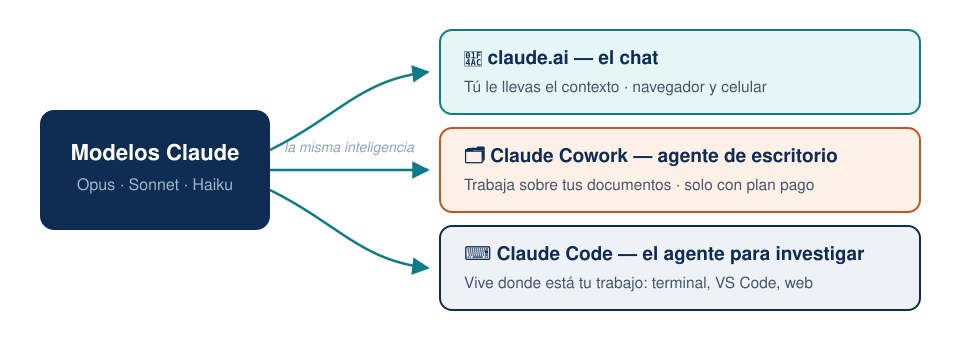

## Plan de hoy (3 horas) {.smaller}

| Bloque | Tema | Tiempo |
|--------|------|--------|
| 1 | Qué es y qué no es — el caso real | 25 min |
| 2 | Las reglas de seguridad | 20 min |
| 3 | Ejercicio: diagnóstico de su computadora | 25 min |
| 4 | El terminal mínimo + primera conversación | 30 min |
| ☕ | Pausa | 10 min |
| 5 | La memoria del proyecto: `/init` | 20 min |
| 6 | ⭐ La trampa de la cita | 30 min |
| 7 | La biblioteca PUCP | 15 min |
| 8 | Cierre y tarea | 5 min |

[Los asistentes del Q-LAB están en la sala: levanten la mano ante cualquier problema técnico y ellos los ayudan sin detener la clase.]{.small .muted}

# Bloque 1 — Qué es y qué no es

## Claude Code, en una frase

> Un agente que vive en su computadora, **ve sus archivos** y puede
> **trabajar sobre ellos** por usted.

. . .

No es un chat al que le pegan texto. La diferencia práctica:

| En el chat de siempre | Con Claude Code |
|---|---|
| "Resúmeme este paper" *(y usted pega el texto)* | "Lee los **40 PDF de esta carpeta**, dime cuáles usan datos de panel y arma una tabla" |
| Usted copia la respuesta a Word | Él **crea y edita los archivos** directamente |

## Lo que hizo en un caso real {.smaller}

En una sesión de trabajo real, sobre un curso de teoría económica:

- Leyó el sílabo y verificó **cada cita** contra Crossref, NBER y arXiv.
  Encontró **cuatro citas equivocadas** — incluida una donde el título del paper no existía y otra donde faltaba un coautor.
- Descargó **28 papers**, varios a través del proxy de la biblioteca PUCP.
- Escribió el sílabo en LaTeX, lo **compiló** y revisó el PDF resultante.
- Armó la **página web del curso** y la publicó.

. . .

::: {.callout-tip}
## Nada de eso requiere saber programar
Sí requiere saber **qué pedirle y cómo verificarlo** — de eso trata este taller.
:::

## La idea central del taller {.smaller}

> **Lo más valioso que hizo el agente no fue escribir: fue encontrar errores.
> Y también los cometió.**

. . .

- **Encontró errores reales:** un paper citado con otro título, un coautor que no figuraba, una muestra de 5 346 observaciones citada como 5 838. Nadie lo había notado.
- **Cometió errores:** anotó un DOI inventado. Se descubrió al intentar descargarlo — la página daba error.

. . .

**La regla que gobierna todo lo demás:**

[Lo que produce **de memoria** → hay que verificarlo. Lo que verifica **contra una fuente, con el enlace a la vista** → es sólido.]{.warm}

## Una familia de productos — no se confundan

{width=88% fig-align="center"}

## ¿Cuál necesito yo? ¿Cuánto cuesta? {.smaller}

| Producto | ¿Para quién? | Acceso |
|----------|--------------|--------|
| **claude.ai** (el chat) | Preguntas, borradores, explicaciones | Gratis con límites · Pro **$20/mes** |
| **Claude Cowork** | Trabajo sobre documentos sin terminal | ❌ **Solo con plan pago** ($20/mes o más) |
| **Claude Code** | Investigación: datos, PDFs, LaTeX | ✅ Suscripción **o solo una clave API** (paga por uso) |

. . .

- El chat es como un **tutor**: excelente para que le expliquen un concepto (*"¿qué es diferencias en diferencias?"*).
- Claude Code es el **asistente de investigación**: trabaja sobre *sus* carpetas, *sus* datos, *sus* papers.
- Regla del taller: **usen el modelo Opus para todo**. Fable solo para redacción fina — es caro y se agota rápido.


## Así trabaja: el ciclo del agente {.smaller}

{width=60% fig-align="center"}

- Cada acción pasa por herramientas: leer, editar, ejecutar, buscar.
- Cada acción riesgosa **pide su aprobación** primero.
- Usted es quien dirige la investigación; Claude es un asistente muy rápido.

# Bloque 2 — Las reglas de seguridad

## Nunca va a escribir su contraseña

**Claude Code no ingresa contraseñas en formularios. Nunca.**
Ni la suya, ni ninguna. No importa que se la den o que insistan: es una restricción **sin excepciones**.

. . .

Tampoco: crea cuentas · ingresa datos de tarjetas · resuelve CAPTCHAs.

. . .

::: {.callout-tip}
## No es un obstáculo: es un reparto de tareas
1. **Usted** se loguea en el navegador, una sola vez.
2. **El agente** trabaja sobre esa sesión ya abierta.

Así se descargaron los papers de la biblioteca en el caso real: el profesor se logueó, el agente hizo el resto.
:::

## Antes de estas acciones, siempre pregunta {.smaller}

- Descargar archivos
- Aceptar términos y condiciones
- Enviar correos o mensajes
- Publicar contenido
- Borrar o sobrescribir cosas

. . .

**Es sano.** Cuando pregunte, **lean qué está por hacer** antes de decir que sí.

. . .

[Si algo parece "trabado" y no avanza, casi siempre es que les está haciendo una pregunta y espera respuesta. Miren la pantalla.]{.warm}

# Bloque 3 — Diagnóstico de su computadora

## Su turno: el primer ejercicio {.your-turn}

Abran una terminal (los asistentes ayudan), escriban `claude`, presionen Enter, y pídanle **literalmente esto**:

```text
Revisa mi entorno: dime qué versión tengo de git, python y latex,
si tengo credenciales de GitHub configuradas, y qué me falta instalar.
```

. . .

**Qué observar:** el agente **ejecuta comandos y les muestra qué hace**. No les contesta de memoria: está mirando *su* máquina.

::: {.callout-note}
Este ejercicio es a la vez el diagnóstico: si algo falta, el propio agente les dice cómo instalarlo. Es la primera lección de actitud — **cuando tengan una duda técnica, pregúntenle a Claude**.
:::

## Elegir el modelo (una sola vez) {.smaller}

Dentro de Claude, escriban `/model` y elijan **Opus**.

| Modelo | ¿Cuándo? |
|--------|----------|
| **Opus** | ✅ Todo el trabajo del día a día: datos, tablas, LaTeX, organización |
| **Fable** | Solo redacción fina de un paper — es caro y el límite se agota en horas |
| Sonnet, Haiku | No los necesitan por ahora |

. . .

[Si un día algo responde "raro", lo primero que deben revisar es `/model`: ¿qué modelo quedó seleccionado?]{.small .muted}

# Bloque 4 — El terminal mínimo

## ¿Qué es "el terminal"? (sin miedo)

Una ventana donde uno escribe **instrucciones en texto** en lugar de hacer clics.

. . .

La buena noticia de 2026:

- **No necesitan memorizar comandos** — Claude los escribe y ejecuta por ustedes.
- Ustedes solo necesitan **UNO**: `cd` (*change directory* = "cámbiate a esta carpeta").

. . .

¿Por qué uno solo? Porque lo único que ustedes hacen a mano es **decirle en qué carpeta trabajar**. Todo lo demás se pide conversando.

## Paso a paso: abrir Claude en su carpeta {.smaller}

1. Abran **VS Code** → menú **Terminal** → **New Terminal**.
   [Tip: si la ventanita de abajo les parece chica, repitan Terminal → *New Terminal Window* para tener una ventana grande aparte (a veces hay que abrir el terminal una vez para que aparezca esa opción).]{.small}
2. En el panel izquierdo de VS Code, busquen la **carpeta de su investigación** → clic derecho → **Copy Path**.
3. En el terminal escriban `cd`, un espacio, **peguen la ruta**, Enter.
4. Escriban `claude`, Enter.
5. Les preguntará si confían en esa carpeta → **Yes**.

. . .

```text
cd /Users/su-nombre/Documents/mi-investigacion
claude
```

[Ese es TODO el "código" que este taller les va a pedir escribir.]{.warm}

## 🧯 Kit de rescate — guarden este slide {.smaller}

Todos nos atascamos. Esto resuelve el 95 % de los líos:

| Problema | Solución |
|----------|----------|
| Claude está haciendo algo que no quiero | <kbd>Esc</kbd> — lo interrumpe sin romper nada |
| Quiero salir de Claude | <kbd>Ctrl</kbd>+<kbd>C</kbd> **dos veces** |
| Me metí a la carpeta equivocada | Salgan (Ctrl+C ×2), `cd` con la ruta correcta, `claude` de nuevo |
| Cerré todo, ¿perdí mi conversación? | No: `claude --resume` muestra sus conversaciones anteriores |
| Nada responde y no sé qué pasa | Cierren la ventana del terminal, abran una nueva y retomen |

. . .

::: {.callout-tip}
Y la herramienta universal: **tómenle captura de pantalla al problema, péguenla en Claude** (Ctrl+V / Cmd+V en el chat del terminal) y pregunten *"¿por qué me sale esto?"*. Claude se depura a sí mismo sorprendentemente bien.
:::

## Su turno: la primera conversación {.your-turn}

Ya dentro de su carpeta real, prueben estas preguntas — **ninguna modifica nada**, solo leen:

```text
Dame un resumen de esta carpeta: ¿qué archivos hay y de qué trata?
```
```text
¿Qué archivos parecen versiones duplicadas o viejas?
```
```text
Explícale la estructura de esta carpeta a un nuevo asistente
de investigación.
```

. . .

**Qué observar:** responde sobre **sus** archivos reales, citando nombres y contenidos. Eso es lo que un chat de la web no puede hacer.

## Su turno: poner orden (con plan previo) {.your-turn .smaller}

El ejercicio favorito de todos — sobre una carpeta real de PDFs acumulados:

```text
En esta carpeta hay PDFs de artículos. Ábrelos y renómbralos con el
formato apellido-año-palabraclave.pdf. ANTES de renombrar nada,
muéstrame la lista de cambios que vas a hacer.
```

. . .

**Qué observar:**

1. **Pedir el plan antes de ejecutar** es el hábito de seguridad número uno.
2. El agente **lee el contenido del PDF** — no adivina por el nombre del archivo.

# ☕ Pausa — 10 minutos

# Bloque 5 — La memoria del proyecto

## El problema: cada sesión empieza de cero {.smaller}

Mañana abren Claude y ya no recuerda:

- que su proyecto usa datos de la ENAHO y no se tocan los originales,
- que ustedes escriben en español y citan en APA,
- de qué trata la investigación.

. . .

**La solución:** un archivo llamado `CLAUDE.md` en la carpeta del proyecto, que Claude **lee automáticamente al iniciar**.

::: {.callout-note}
## ¿"`.md`"? — su primer archivo markdown
Markdown es solo **texto simple con formato ligero** (títulos con `#`, listas con `-`). Se abre con cualquier editor. No hay que aprenderlo: Claude lo escribe; ustedes lo leen y corrigen.
:::

## `/init`: que él lo escriba

Dentro de Claude, escriban:

```text
/init
```

. . .

Claude **explora toda la carpeta** — lee sus documentos, sus datos, sus PDFs — y redacta el `CLAUDE.md` por ustedes: de qué trata el proyecto, cómo está organizado, qué convenciones sigue.

. . .

Después ustedes lo **editan como cualquier documento**: agregan reglas suyas, por ejemplo:

```markdown
- Nunca modifiques los archivos de la carpeta datos-originales/
- Las citas siempre en formato APA 7
- Respóndeme siempre en español
```

## La memoria tiene niveles

{width=76% fig-align="center"}

[Ninguno existe por defecto: el del proyecto lo genera `/init`; el personal lo crean ustedes (o el atajo `#`); el de subcarpeta es opcional.]{.small .muted}

## Los modos de trabajo (y el freno de mano) {.smaller}

Con <kbd>Shift</kbd>+<kbd>Tab</kbd> se cambia de modo — mírenlo en la **barra de abajo** de Claude:

{width=88% fig-align="center"}

- **Plan Mode** (solo lee y propone): para empezar cualquier cosa nueva — les presenta un plan y ustedes aprueban. *Lo usaremos a fondo en la Sesión 2.*
- **Normal**: pregunta antes de cada cambio. El modo de esta sesión.
- **Auto-accept**: ejecuta sin preguntar. Solo cuando ya confían y el trabajo es rutinario.
- El cuarto modo existe, pero **no lo usen**: desactiva todas las protecciones.

# Bloque 6 — ⭐ La trampa de la cita

## El ejercicio más importante del taller {.your-turn}

**Primera parte** — pídanle esto, tal cual:

```text
Dame la cita completa, en APA, del paper de Noy y Zhang sobre los
efectos de ChatGPT en la productividad. Incluye volumen, número,
páginas y DOI.
```

. . .

Obtendrán una cita hermosa, con todos sus datos, en segundos.

[**No la usen todavía.**]{.warm}

## Segunda parte: ahora verifica {.your-turn}

```text
Ahora verifica cada dato de esa cita contra Crossref y dime
exactamente qué estaba mal.
```

. . .

**Qué observar:** es muy frecuente que algo no cuadre — un número de páginas, un año, un DOI. **Y el mismo agente lo detecta cuando se le pide verificar.**

. . .

::: {.callout-important}
## La lección central del taller
No es que "mienta": es que **recordar** y **verificar** son dos modos distintos de trabajo, y el segundo **hay que pedirlo explícitamente**. Todo lo que vaya a una publicación de ustedes pasa por el modo verificar.
:::

## La regla, para llevarse a casa

| Origen de la información | Confianza |
|---|---|
| La produjo **de memoria** (una cita, una fecha, un número) | ⚠️ Verificar siempre |
| La **verificó contra una fuente** con el enlace a la vista (Crossref, el PDF, la página oficial) | ✅ Sólida |

. . .

Por eso los mejores prompts incluyen **dónde está la verdad**:

```text
Verifica contra el PDF que está en la carpeta papers/
```
```text
Consulta Crossref antes de darme cualquier DOI
```

# Bloque 7 — La biblioteca PUCP

## El proxy de la biblioteca: elogim {.smaller}

La PUCP tiene acceso institucional a bases suscritas. El punto de entrada:

```text
https://pucp.elogim.com/auth-meta/login.php?url=<URL DEL EDITOR>
```

Pegan cualquier dirección de una revista después de `url=` y, si hay suscripción, entra con acceso institucional. Ejemplo para un artículo de JSTOR:

```text
https://pucp.elogim.com/auth-meta/login.php?url=https://www.jstor.org/stable/2171832
```

. . .

**El patrón de trabajo** (el reparto de tareas del Bloque 2):

```text
Estoy logueado en la biblioteca PUCP. Busca este artículo [DOI] y
descárgalo a la carpeta papers/. Si no tenemos acceso, dime dónde
más se puede conseguir.
```

## Tres cosas que cuestan descubrir solo {.smaller}

1. **Su cuenta personal no es el acceso institucional.** Con usuario propio en JSTOR solo *leen en pantalla*; el botón de descarga aparece bajo la sesión de la Universidad. Es el error más común.
2. **La sesión va por cookie** — tiene que ser un navegador logueado. Si el agente intenta descargar "por código" va a fallar: díganle *"usa el navegador"*.
3. **Que la página cargue no significa que haya suscripción.** Hay que llegar hasta el PDF. (Comprobado que **no** tenemos: Management Science/INFORMS ni Oxford — o sea, ni QJE ni ReStud por esta vía.)

. . .

**Cuando no hay acceso**, casi siempre existe versión abierta: NBER, SSRN, arXiv, repositorios de los autores, Google Scholar.

::: {.callout-warning}
El *working paper* no es el artículo publicado — hay casos con distinto título y hasta distintos autores. Para **citar**, la versión publicada; para leer, cualquiera — sabiendo cuál tienen.
:::

# Bloque 8 — Cierre

## Lo que ya saben hacer {.smaller}

- Distinguir el chat, Cowork y **Claude Code** — y qué cuesta cada uno.
- Las reglas de seguridad: contraseñas nunca; **ustedes se loguean, él trabaja**.
- Abrir Claude en su carpeta con el único comando necesario (`cd`).
- El kit de rescate: <kbd>Esc</kbd>, <kbd>Ctrl</kbd>+<kbd>C</kbd> ×2, `claude --resume`.
- Darle memoria al proyecto con `/init` + `CLAUDE.md`.
- **La lección central: memoria ≠ verificación.** Pidan verificar, siempre.
- Descargar de la biblioteca PUCP con el patrón "yo me logueo, él opera".

## Tarea para la próxima sesión {.your-turn .smaller}

Elijan **una tarea real y pequeña** de su propia investigación:

1. Corran `/init` en la carpeta de un proyecto suyo y **lean** el `CLAUDE.md` que genera. Corrijan lo que no le gustó.
2. Pídanle que ordene y renombre una carpeta de PDFs acumulados — **con plan previo**.
3. Verifiquen la bibliografía de algo que estén escribiendo: *"revisa cada cita de este documento contra Crossref y dime cuáles tienen errores"*.

. . .

**Próxima sesión:** el flujo completo de investigación — revisión de literatura automática con `/deep-research`, dashboards de datos, LaTeX sin escribir LaTeX, y cómo convertir sus clases grabadas en material de trabajo.

## Referencias {.smaller}

- Guía escrita de este taller (guion + manual): carpeta `profesores/` del repositorio del curso
- Sant'Anna, P. H. C. — *My Claude Code Workflow*: [psantanna.com/claude-code-my-workflow](https://psantanna.com/claude-code-my-workflow/workflow-guide.html)
- Documentación oficial: [code.claude.com/docs](https://code.claude.com/docs)
- Biblioteca PUCP: [biblioteca.pucp.edu.pe](https://biblioteca.pucp.edu.pe)

[Estos slides fueron escritos, diagramados y compilados con Claude Code — incluyendo el análisis de las grabaciones de las clases piloto con los asistentes del Q-LAB.]{.small .muted}
