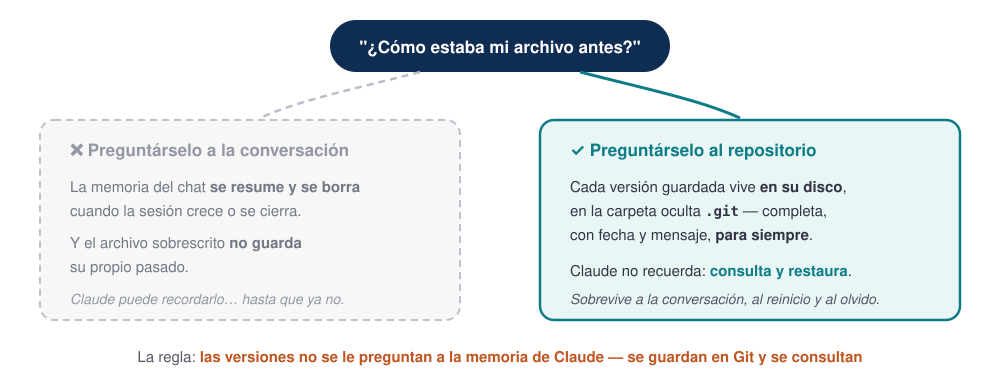
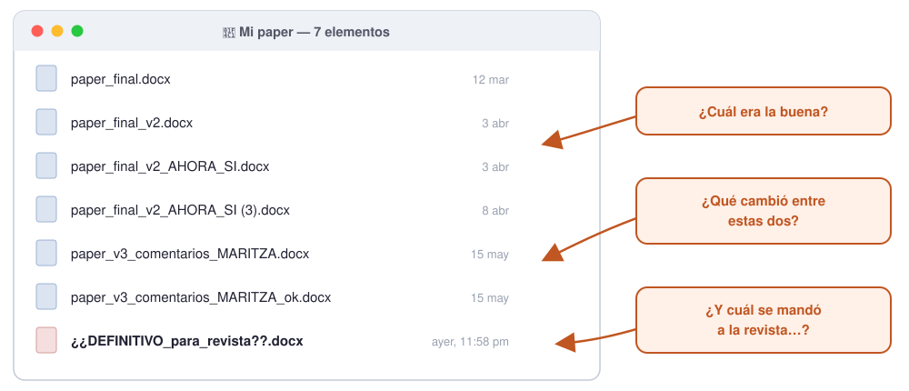
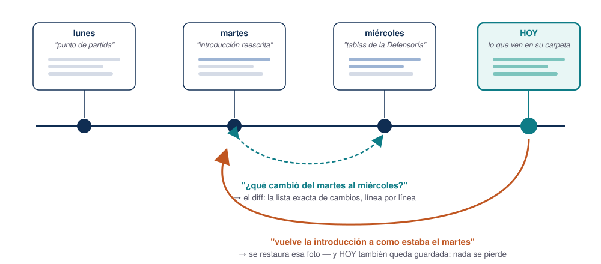
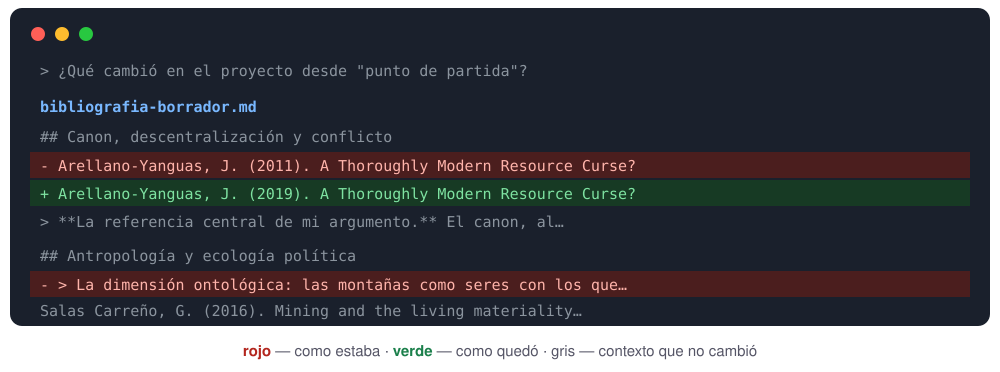
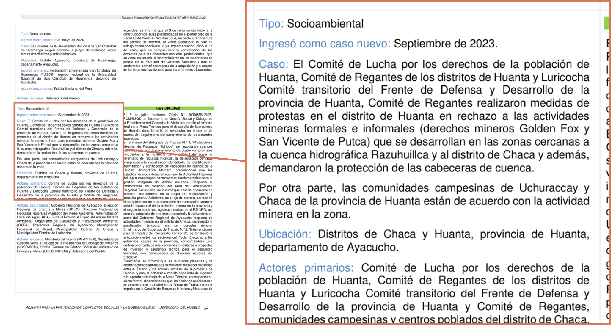
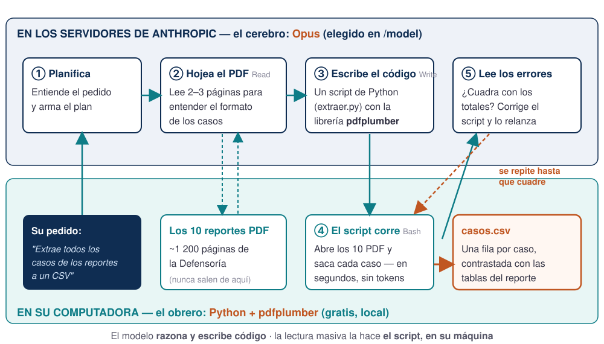
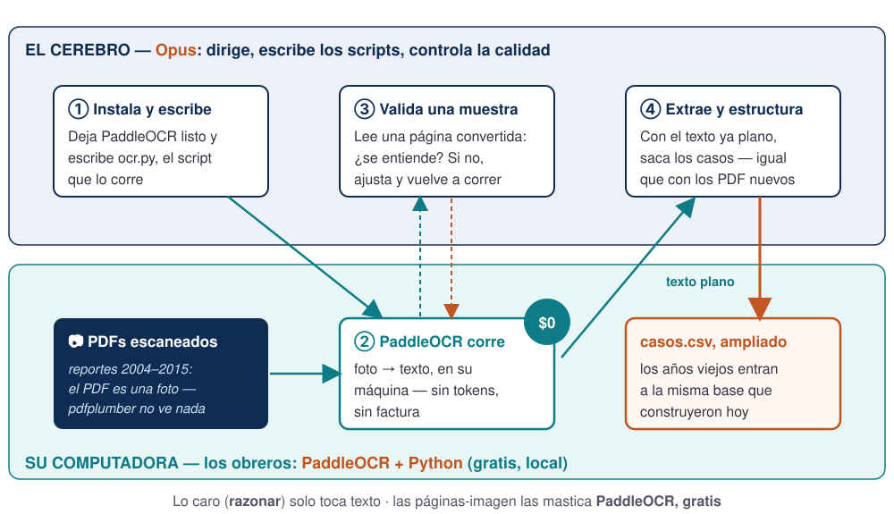

## Plan de hoy (3 horas) {.smaller}

| Hora | Bloque | Tema |
|------|--------|------|
| 6:00 – 6:20 | 1 | Repaso y Plan Mode |
| 6:20 – 6:55 | 2 | Git: la máquina del tiempo de su carpeta |
| 6:55 – 7:30 | 3 | ⭐ De 10 PDFs a una base de datos: extraer |
| 7:30 – 7:40 | ☕ | Pausa 1 |
| 7:40 – 8:20 | 3 | ⭐ OCR: los escaneados también entran a la base |
| 8:20 – 8:30 | ☕ | Pausa 2 |
| 8:30 – 8:50 | 4 | Whisper: sus clases se vuelven material |
| 8:50 – 9:00 | — | Háblenle, no le tipeen + cierre |

[Hoy varias demos toman minutos en correr: las lanzamos al inicio y revisamos resultados al final de cada bloque. Así se trabaja de verdad con agentes.]{.small .muted}

# Bloque 1 — Repaso y Plan Mode

## La sesión pasada, en 6 movimientos {.smaller}

| Movimiento | Cómo |
|------------|------|
| Abrir Claude en mi carpeta | `cd` + pegar ruta → `claude` |
| Salir de un lío | <kbd>Esc</kbd> interrumpe · <kbd>Ctrl</kbd>+<kbd>C</kbd> ×2 sale · `claude --resume` recupera |
| Memoria del proyecto | `/init` genera el `CLAUDE.md`; ustedes lo corrigen |
| Elegir modelo | `/model` → **Opus** para todo |
| La regla de oro | Lo que recuerda se **verifica**; lo que comprueba contra fuente, es sólido |
| **La literatura, completa** | `/deep-research` → verificar contra Crossref → biblioteca (un solo login) → revisión en LaTeX compilada |

. . .

Pregunta de control: *¿quién corrió `/init` en un proyecto real? ¿Qué entendió bien y qué corrigieron?*

## Piensen como jefes de investigación

La forma correcta de trabajar con Claude Code no es una conversación eterna: son **varias sesiones en paralelo, como asistentes con tareas asignadas**.

. . .

- Sesión 1 → *"extrae los casos de estos PDF a una base"*
- Sesión 2 → *"explora y describe esta base de datos"*
- Sesión 3 → *"arma la presentación con lo que ya está listo"*

. . .

Cada sesión con **una tarea clara y acotada**. Ustedes supervisan, corrigen y deciden — como con un equipo humano, pero con la paciencia infinita y el costo de una suscripción.

## Plan Mode: pensar antes de tocar

<kbd>Shift</kbd>+<kbd>Tab</kbd> hasta que la barra inferior diga **plan mode**: Claude puede **leer y proponer, pero no tocar nada**.

{width=100% fig-align="center"}

. . .

¿Cuándo? **Siempre que empiecen algo nuevo o no sepan por dónde ir.** Claude explora, les presenta un plan numerado, ustedes lo leen, cambian lo que quieran, y recién entonces se ejecuta.

[Revisar un plan cuesta 2 minutos. Revisar 40 archivos modificados cuesta una tarde.]{.warm}

# Bloque 2 — Git: la máquina del tiempo de su carpeta

## "¿Cómo estaba mi archivo antes?" {.smaller}

La pregunta llegó de uno de ustedes tras la primera sesión: *"cada vez que Claude modifica un archivo, tengo que preguntarle cómo estaba antes — por si acaso"*.

{.nostretch width=74% fig-align="center"}

[Ese programa que guarda las versiones se llama **Git**: gratuito, vive en su computadora, y Claude lo maneja por ustedes.]{.warm}

## El problema que todos conocemos {.smaller}

{.nostretch width=76% fig-align="center"}

Ese desorden no es un defecto suyo: es **control de versiones a mano** — y falla justo cuando importa. [Git resuelve las tres preguntas con una sola idea →]{.warm}

## Qué es: fotos de su carpeta, con fecha y mensaje {.smaller}

{.nostretch width=78% fig-align="center"}

Cada punto de la línea es una **foto completa** de la carpeta, que se puede consultar o restaurar cuando haga falta. [Un solo archivo, toda la historia — las tres preguntas del slide anterior, respondidas.]{.muted}

## Tres palabras, tres pedidos {.smaller}

Todo el vocabulario de hoy — y el pedido exacto para cada etapa, **listo para copiar**:

**Repositorio** — la carpeta vigilada por Git (*"mi proyecto, con historia"*). Para setearlo:

```text
Convierte esta carpeta en un repositorio de Git y confírmame
que quedó listo.
```

**Versión** (*commit*) — una foto completa de la carpeta, con fecha y mensaje. Para tomarla:

```text
Guarda una versión de todo el proyecto con el mensaje
"avance de hoy: bibliografía revisada".
```

**Diff** — la comparación exacta entre dos fotos. Para pedirla:

```text
¿Qué cambió en el proyecto desde la última versión guardada?
Muéstramelo línea por línea.
```

[Y para ver la línea de tiempo entera: *"muéstrame la lista de versiones guardadas, con fecha y mensaje"*. No hay más vocabulario que aprender hoy.]{.small .muted}

## ⚡ Su turno ① — enciendan la máquina del tiempo {.your-turn .smaller}

En la carpeta del proyecto de ejemplo, pidan **literalmente esto**:

```text
¿Tengo Git instalado? Si no, instálalo. Luego convierte esta
carpeta en un repositorio y guarda la primera versión de todo
el proyecto con el mensaje "punto de partida".
```

. . .

**Qué observar:**

1. En Mac, Git suele venir instalado; en Windows, Claude lo instala en un minuto.
2. Aparece una carpeta oculta **`.git`** — la caja donde vivirán todas las fotos. No se toca.
3. Sus archivos siguen **idénticos**. Git observa; no estorba.

## ⚡ Su turno ② — rompan, comparen, vuelvan {.your-turn .smaller}

Tres pedidos, en orden, sobre la bibliografía del proyecto:

```text
1. En bibliografia-borrador.md cambia el año de Arellano-Yanguas
   de 2011 a 2019, y borra la nota que sigue a Salas Carreño.
```

```text
2. ¿Qué cambió en el proyecto desde "punto de partida"?
   Muéstramelo línea por línea.
```

```text
3. Uy, no — vuelve TODO a como estaba en "punto de partida".
```

. . .

[Fíjense en lo que eligieron romper: **la referencia central del argumento** ahora cita un año falso — a ojo, nadie lo notaría jamás.]{.warm}

## Lo que les va a mostrar el pedido 2 {.smaller}

{.nostretch width=80% fig-align="center"}

El diff **lo canta en un segundo**: el año adulterado y la nota borrada, línea por línea. Y el pedido 3 restaura todo, **instantáneo y total**. [Acaban de perderle el miedo a que Claude toque sus archivos.]{.warm}

## Que se guarde solo: dos líneas en `CLAUDE.md` {.smaller}

No hace falta acordarse de guardar versiones. Agréguenle esto al `CLAUDE.md` del proyecto (la memoria de ayer):

```markdown
## Versiones
- Antes de modificar cualquier archivo, guarda una versión en Git.
- Al terminar cada sesión, guarda una versión con un mensaje que
  resuma qué se logró.
```

. . .

Desde ese momento, **Claude guarda versiones solo** — ustedes solo piden volver cuando haga falta.

. . .

[Límites honestos: Git **no es respaldo** (vive en el mismo disco — la nube, otro día) y brilla con texto (`.md`, `.tex`, `.csv`); los ZIP pesados mejor quedan fuera.]{.small .muted}

## Lo que cambia desde hoy {.smaller}

| Antes | Ahora |
|---|---|
| "¿Cómo estaba ayer?" → preguntarle a Claude, cruzar los dedos | → preguntarle **al repositorio**: respuesta exacta |
| Miedo a que Claude rompa algo | Todo cambio es **reversible** |
| `paper_v2_FINAL(3).docx` | Una carpeta limpia, con **toda su historia** |
| Guardar versiones: un hábito más que mantener | Dos líneas en `CLAUDE.md` y **se guarda solo** |

# Bloque 3 — ⭐ De 10 PDFs a una base de datos

## El problema, con nombre propio {.smaller}

La Defensoría del Pueblo publica un **reporte mensual de conflictos sociales**
desde 2004. Van **269 reportes**. Cada uno trae, caso por caso: tipo, fecha de
inicio, ubicación, **descripción narrativa** y los actores involucrados.

. . .

Todos en **PDF**. Ninguno en Excel.

[Nadie tiene esa serie como base de datos. Nadie.]{.warm}

. . .

::: {.callout-note}
## Esto es exactamente el trabajo de un asistente
Copiar 103 casos de un PDF a un Excel toma una tarde. Por doce meses, dos semanas.
Y hay que hacerlo otra vez el mes que viene.
:::

## Así se ve la "base de datos" hoy {.smaller}

{.nostretch width=72% fig-align="center"}

La página 54 del reporte n.º 268, **tal cual**: cada caso trae `Tipo`, fecha de ingreso, `Caso` (la narrativa), `Ubicación` y `Actores` — texto corrido, caso tras caso, por **122 páginas**. [Todo lo que necesitamos ya está aquí. Solo que en el peor formato posible para analizarlo.]{.warm}

## Paso 1 — extraer {.your-turn .smaller}

En `datos/` del proyecto de ejemplo están los 10 reportes.

```text
En datos/ hay reportes de conflictos sociales de la Defensoría en PDF.
Cada caso tiene tipo, fecha de inicio, ubicación, descripción y actores.
Extrae todos los casos a un CSV en datos-limpios/, una fila por caso,
con una columna que indique de qué reporte salió.
```

. . .

**Qué observar:** el ciclo completo sin intervención — abre el PDF, encuentra el
patrón, escribe el código, lo corre, **ve que algo no cuadra y lo arregla**.

. . .

[Aviso: los nombres de los archivos son un desastre (`N°-259`, `n.º-258`, `n-265-VF`). Son los nombres reales de la Defensoría. Nadie limpió nada para ustedes.]{.small .muted}

## Lo que hizo por detrás, paso a paso {.smaller}

{.nostretch width=92% fig-align="center"}

## ¿Quién hace qué? (y qué viaja a dónde) {.smaller}

| Pieza | Dónde vive | Qué hace en este ejercicio |
|---|---|---|
| **Opus** — el modelo que eligieron en `/model` | Servidores de Anthropic | Razona: entiende el pedido, **escribe el código**, interpreta los errores, decide cuándo está listo |
| **PyMuPDF** — librería de Python, gratuita | **Su computadora** | El trabajo pesado: abre las ~1 200 páginas y extrae el texto **con sus coordenadas**. El modelo nunca "lee" todo eso |
| Las herramientas (`Read`, `Write`, `Bash`) | Su computadora | Las manos: conectan al modelo con sus archivos y su Python |

. . .

**Qué viaja a Anthropic:** su pedido, las 2–3 páginas de muestra que hojea, y los errores del script. **Qué no viaja:** los 10 PDF completos — esos los procesa el script, en local.

. . .

[Ojo: cuando el trabajo sea **leer y juzgar** cada narrativa — clasificar demandas, resumir casos — la división se invierte: eso es trabajo de cerebro, no de obrero, y sí consume tokens en serio.]{.warm}

[Además, Claude Code usa por dentro modelos pequeños y baratos (Haiku) para tareas de apoyo: resúmenes, títulos, búsquedas internas.]{.small .muted}

## ⚠️ El momento en que la extracción no cuadra {.smaller}

Corrí este ejercicio sobre el reporte n.º 269 y salieron **tres números distintos** para la misma pregunta — *¿cuántos casos hay?*

| Cifra | Valor |
|---|---|
| Conflictos que el propio reporte declara en su página 2 | **191** |
| Veces que aparece la palabra `Caso:` en el PDF | **103** |
| Casos con ficha completa: descripción **y** actores | **64** |

. . .

Tres razones, todas verificables abriendo el PDF:

1. `Caso:` no marca un tipo de registro sino **tres** — fichas de mediación, mesas de diálogo y conflictos.
2. El reporte **narra en detalle solo los casos con hechos nuevos del mes**; los demás aparecen únicamente en tablas resumidas.
3. El formato **cambia entre reportes**: solo el n.º 269 numera los casos con `Código:`.

. . .

[Quien no valida se lleva una base que cubre **la mitad del universo** y sobrerrepresenta los conflictos ruidosos — sin saberlo. En un paper, eso es fatal.]{.warm}

[La regla de la sesión pasada, mudada de las citas a los datos: **cada reporte publica sus propios totales — úsenlos**.]{.small .muted}

# ☕ Pausa 1 — 10 minutos {background-color="#e6fbfc"}

[Volvemos 7:40 pm]{.big}

[¿La extracción del Paso 1 no les salió? Es el momento de llamar a un asistente del Q-LAB — al volver la necesitamos lista.]{.small .muted}

## ¿Y si el PDF es una foto? PaddleOCR {.smaller}

Los reportes recientes traen texto nativo. Pero el archivo histórico —lo que está en bibliotecas— es **escaneado**: el PDF es una foto, y PyMuPDF devuelve… nada.

En `datos/antiguos/` les dejé un caso real: la revista **QUEHACER n.º 173**, 132 páginas escaneadas con la marca de agua de la biblioteca de San Marcos encima.

. . .

Para eso existe **PaddleOCR**: un kit de OCR **gratuito y open source** (Apache 2.0) que corre **en su computadora**.

- Versión **PP-OCRv6** (2026): un solo modelo lee **50 idiomas** — español incluido — y entiende tablas y estructura, no solo texto corrido.
- Lo corrí sobre esas 132 páginas: **6 min 32 s**, confianza media **0,993**.

. . .

::: {.callout-important}
## Si trabajan en Mac, sépanlo antes de la clase
PaddleOCR **no usa la GPU en Mac**: la versión para Apple Silicon se compila sin CUDA y pedirle GPU falla con un error explícito. Corre en CPU. La velocidad no viene del chip sino de **procesar varias páginas a la vez**: de 10 s por página a **3 s**.
:::

[Descarga y documentación: **github.com/PaddlePaddle/PaddleOCR**]{.warm}

## ¿Cuánto cuesta leer 100 páginas escaneadas? {.smaller}

Las APIs de visión también pueden "leer" un escaneo — mandándole cada página como imagen. La diferencia está en la factura:

| Herramienta | Tarifa (entrada · salida, por millón de tokens) | PDF de 100 págs. | El archivo entero (~31 500 págs.) |
|---|---|---|---|
| **PaddleOCR, local** | **no cobra** | **$0** | **$0** |
| DeepSeek V4 (vision) — el más barato | ~$0.44 · $1.32 | ~$0.20 | ~$60 |
| Claude Haiku 4.5 | $1 · $5 | ~$0.60 | ~$190 |
| Claude Opus — el más caro | $5 · $25 | ~$3.00 | ~$950 |

[Estimado con ~2 000 tokens de imagen + 800 de texto por página; precios de agosto 2026. "El archivo entero": los 269 reportes de la Defensoría desde 2004. Las demás APIs de visión caen dentro de ese rango.]{.small .muted}

. . .

**La jugada inteligente no es elegir bando:** PaddleOCR extrae el texto **gratis**, y el modelo razona sobre ese texto — que cuesta centavos, no dólares. [Excepción honesta: manuscritos y tablas muy dañadas — ahí los modelos de visión sí ganan.]{.small}

## El pipeline, ahora con fotos {.smaller}

{.nostretch width=90% fig-align="center"}

## ⚡ Paso 2 — PaddleOCR sobre los escaneados {.your-turn .smaller}

En `datos/antiguos/` está la revista escaneada. El pedido, **listo para copiar**:

```text
En datos/antiguos/ hay un PDF escaneado de 132 páginas, con la
marca de agua de la biblioteca encima.
1. Instala PaddleOCR con sus dependencias y dime qué instalaste.
2. Convierte SOLO la página 20 y muéstrame el texto: quiero
   validar la calidad antes de seguir.
3. Si apruebo, convierte el documento entero a datos-limpios/ocr/,
   un .txt por página y otro con todo junto.
4. Al final: páginas procesadas, tiempo total, confianza media y
   qué páginas quedaron dudosas para revisarlas a mano.
```

. . .

**Qué observar:** el punto 2 es la disciplina de siempre — **una muestra antes de correr todo**; la conversión corre **en su máquina, sin tokens**; y la confianza del punto 4 es la tasa de error del OCR: **se mide, no se supone**.

. . .

[Dos cosas que aparecen solas si miran el resultado: el PDF **ya traía** una capa de texto —del escáner, pésima: *co11trola11do*, *Sl!GURA*— y el OCR nuevo la corrige; y la marca de agua **desaparece** si se trabaja sobre la imagen escaneada en vez de sobre la página completa.]{.small .muted}

# ☕ Pausa 2 — 10 minutos {background-color="#e6fbfc"}

[Volvemos 8:30 pm]{.big}

[El OCR del Paso 2 puede seguir corriendo solo mientras tanto — así se trabaja con agentes: no se les mira, se les asigna.]{.small .muted}

# Bloque 4 — Whisper: sus clases se vuelven material

## La idea

Sus conversaciones más valiosas son **habladas** — clases, seminarios, asesorías — y normalmente **se evaporan**.

{.nostretch width=94% fig-align="center"}

**Whisper**: transcriptor **gratuito y local** — el audio nunca sale de su máquina. [En Mac, mlx-whisper usa la GPU: los 12 minutos del video del ejercicio, transcritos en **9 segundos**.]{.small .muted}

## La receta, conversando con Claude {.smaller}

**Paso 1 — que Claude conozca su máquina** (una sola vez):

```text
Quiero transcribir grabaciones de mis clases con Whisper.
Primero dime qué computadora tengo (procesador, memoria) y qué
versión de Whisper me conviene instalar. Instálala.
```

[Claude detecta si su equipo puede usar la versión rápida (Mac: mlx-whisper · Windows: faster-whisper) y la deja lista.]{.small}

. . .

**Paso 2 — transcribir y pedir algo útil:**

```text
En datos/ está videoplayback.mp4: un video de ~12 minutos sobre
conflictos sociales. Transcríbelo con marcas de tiempo y guarda
el texto en transcripciones/. Después léelo y dime: qué actores
aparecen, qué demandas plantean, y con qué casos de los reportes
de la Defensoría podría conectarse lo que narra.
```

[Si les falla con `FileNotFoundError: 'ffmpeg'`, no está roto: mlx-whisper trae su propio ffmpeg dentro y solo hay que dejárselo a la vista. Díganle *"no encuentra ffmpeg, arréglalo"* y lo resuelve.]{.small .muted}

## Esto no es teoría: lo hice con este taller {.smaller}

Transcribí la grabación de mi clase piloto con los asistentes del Q-LAB (97 minutos → 90 segundos de procesamiento) y le pedí feedback. Me respondió, entre otras cosas:

> *"El material del día se agotó en 59 minutos; los 38 restantes fueron improvisados. La clase no estaba calibrada en tiempo."*

> *"Elegiste un repositorio demasiado grande para la demo."*

> *"El consejo sobre modelos quedó contradictorio: un alumno no puede salir de ahí con una regla accionable."*

. . .

Tenía razón en las tres. **Esta sesión que están viendo fue rediseñada con ese feedback.**

. . .

[**Y la transcripción también se verifica:** de los 491 fragmentos del video del ejercicio, **195 son solo "Música" y 263 están vacíos** — apenas 33 son habla. Además escribe *"Anacocha"* donde se dice **Yanacocha**. Revisen **cobertura** y **nombres propios** antes de citar.]{.small .muted}

[Usos inmediatos: mejorar sus cursos, actas automáticas de asesorías de tesis, procesar entrevistas de campo (con consentimiento), no perder nunca los comentarios que reciben al presentar un paper.]{.warm}

## El último consejo: háblenle, no le tipeen {.smaller}

Ustedes hablan a ~**150 palabras por minuto** y tipean a ~40. Con voz, el pedido de 2 líneas se vuelve de 2 párrafos — el contexto, las restricciones, el "ah, y también…" — y **el resultado mejora sin que el modelo haya mejorado**: mejoró el pedido.

. . .

Ya viene incluido: escriban `/voice` y **mantengan la barra espaciadora mientras hablan**. Y no hay que pulir el discurso — hablen desordenado, que organizar el enredo es trabajo del modelo.

. . .

No lo decimos nosotros:

> *"You speak 3x faster than you type, and your prompts get way more detailed."* — **Boris Cherny**, creador de Claude Code (2026)

> *"Lean back, switch to /voice and just ramble for like 10 minutes."* — **Andrej Karpathy** (2026)

> *"You stop optimizing keystrokes and start optimizing thinking."* — **Josef Dvorak** (2026)

[El teclado no se jubila: es dictado, y todos mezclan ambos. Fuentes: x.com/bcherny · x.com/karpathy · docs de /voice]{.small .muted}

## Cierre {.smaller}

| Ayer no podían | Hoy sí |
|---|---|
| El chat solo veía lo que le pegaban | Un agente trabaja dentro de sus carpetas |
| Bibliografías a mano, con errores invisibles | Verificación cita por cita contra Crossref |
| Semanas buscando literatura | `/deep-research` + carpeta de papers en 20 min |
| "No sé LaTeX" | PDF y Beamer compilados, sin escribir código |
| "¿Cómo estaba este archivo antes?" | Git guarda cada versión; todo es reversible |
| Las clases se evaporaban | Transcritas, analizadas y con feedback |

. . .

**Soporte continuo:** los asistentes del Q-LAB · la guía escrita del taller (carpeta `profesores/`) · y el propio Claude — pregúntenle a él primero.

**Gracias** — alexander.quispe@pucp.edu.pe

[Estos slides: escritos, diagramados y compilados con Claude Code, y mejorados con el análisis Whisper de las clases piloto.]{.small .muted}
