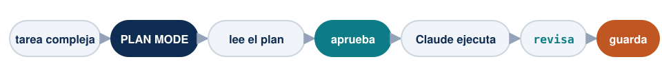
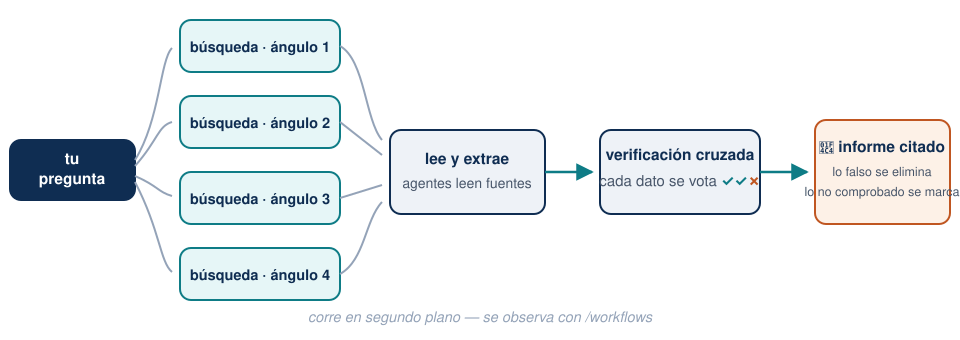
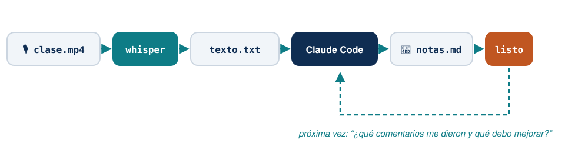

## Plan de hoy (3 horas) {.smaller}

| Bloque | Tema | Tiempo |
|--------|------|--------|
| 1 | Repaso + Plan Mode con un caso real | 25 min |
| 2 | `/deep-research`: la revisión de literatura automática | 30 min |
| 3 | ⭐ De 10 PDFs a una base de datos — y auditarla | 50 min |
| ☕ | Pausa | 10 min |
| 4 | Literatura → LaTeX → presentación, sin escribir código | 30 min |
| 5 | Whisper: sus clases y seminarios se vuelven material | 25 min |
| 6 | Cómo pedir las cosas + errores comunes | 10 min |

[Hoy varias demos toman minutos en correr: las lanzamos al inicio y revisamos resultados al final de cada bloque. Así se trabaja de verdad con agentes.]{.small .muted}

# Bloque 1 — Repaso y Plan Mode

## La sesión pasada, en 5 movimientos {.smaller}

| Movimiento | Cómo |
|------------|------|
| Abrir Claude en mi carpeta | `cd` + pegar ruta → `claude` |
| Salir de un lío | <kbd>Esc</kbd> interrumpe · <kbd>Ctrl</kbd>+<kbd>C</kbd> ×2 sale · `claude --resume` recupera |
| Memoria del proyecto | `/init` genera el `CLAUDE.md`; ustedes lo corrigen |
| Elegir modelo | `/model` → **Opus** para todo |
| La regla de oro | Lo que recuerda se **verifica**; lo que comprueba contra fuente, es sólido |

. . .

Pregunta de control: *¿quién corrió `/init` en un proyecto real? ¿Qué entendió bien y qué corrigieron?*

## Piensen como jefes de investigación

La forma correcta de trabajar con Claude Code no es una conversación eterna: son **varias sesiones en paralelo, como asistentes con tareas asignadas**.

. . .

- Sesión 1 → *"encárgate de la revisión de literatura"*
- Sesión 2 → *"explora y describe esta base de datos"*
- Sesión 3 → *"arma la presentación con lo que ya está listo"*

. . .

Cada sesión con **una tarea clara y acotada**. Ustedes supervisan, corrigen y deciden — como con un equipo humano, pero con la paciencia infinita y el costo de una suscripción.

## Plan Mode: pensar antes de tocar

<kbd>Shift</kbd>+<kbd>Tab</kbd> hasta que la barra inferior diga **plan mode**: Claude puede **leer y proponer, pero no tocar nada**.

{width=100% fig-align="center"}

. . .

¿Cuándo? **Siempre que empiecen algo nuevo o no sepan por dónde ir.** Claude explora, les presenta un plan numerado, ustedes lo leen, cambian lo que quieran, y recién entonces se ejecuta.

[Revisar un plan cuesta 2 minutos. Revisar 40 archivos modificados cuesta una tarde.]{.warm}

## Su turno: Plan Mode con material propio {.your-turn .smaller}

Sobre la carpeta de un curso o proyecto que tengan a la mano:

```text
Este material lo preparé hace tiempo. Quiero modernizarlo: revisa
los documentos, dime qué está desactualizado o inconsistente, y
proponme un plan de actualización. No cambies nada todavía.
```

. . .

**Qué observar:** el plan llega con preguntas de vuelta — *¿actualizo esto?, ¿conservo aquello?* Ese ida y vuelta **es** el modo de trabajo: ustedes deciden, él ejecuta.

::: {.callout-note}
Cuando aprueben el plan, cambien con <kbd>Shift</kbd>+<kbd>Tab</kbd> a **accept edits on** (o **auto mode on**) y déjenlo trabajar. Al final pidan: *"resúmeme todo lo que cambiaste"*.
:::

# Bloque 2 — La revisión de literatura automática

## `/deep-research` — el comando estrella

Escriban el comando **con la barra `/` al inicio** (sin la barra no funciona — es un comando, no una frase) y su pregunta de investigación:

```text
/deep-research ¿Cruzar el umbral de elegibilidad de Pensión 65
  aumenta la adopción de billeteras digitales en el Perú?
```

## Lo que pasa detrás {.smaller}

Un **equipo completo de asistentes** trabajando en paralelo:

{.nostretch width=88% fig-align="center"}

## Cómo se usa bien {.smaller}

1. **Pregunta específica**, como se la darían a un asistente: población, periodo, qué cuenta como respuesta. *"Busca sobre pensiones"* ❌ · *"¿Qué dice la evidencia desde 2019 sobre transferencias a adultos mayores y adopción de pagos digitales en América Latina?"* ✅
2. **Demora 15–20 minutos** y corre en segundo plano — lancémoslo ahora y sigamos la clase; al final del bloque revisamos. Así se trabaja con agentes: no se les mira, se les asigna.
3. Al terminar, pidan el paso que lo convierte en material suyo:

```text
Descarga los papers que citaste en una carpeta papers/,
organizados por tema.
```

4. **Léanlo como referís:** el informe marca lo que no pudo comprobar como *"no verificado"* — empiecen por ahí, y verifiquen las citas antes de que entren a un texto suyo.

## Límites honestos (importan en Ciencias Sociales) {.smaller}

- **Baja sobre todo versiones abiertas** (working papers de NBER, SSRN, arXiv, informes). Para la versión **publicada** en revista: el proxy de la **biblioteca PUCP** que vimos en la Sesión 1 — ustedes se loguean, él descarga.
- **Con libros ayuda poco.** Para antropología, sociología o historia, donde el libro es central, esta herramienta complementa — no reemplaza — la búsqueda en biblioteca.
- **No es un buscador mágico de verdad:** es un equipo de asistentes rápidos que leen lo que está en la web. La curaduría final — qué entra a su marco teórico — sigue siendo de ustedes.

. . .

::: {.callout-tip}
El producto no es solo el informe: es la **carpeta de PDFs organizada y citable** que queda en su proyecto, lista para las siguientes etapas.
:::

# Bloque 3 — ⭐ De 10 PDFs a una base de datos

## El problema, con nombre propio {.smaller}

La Defensoría del Pueblo publica un **reporte mensual de conflictos sociales**
desde 2004. Van **269 reportes**. Cada uno trae, caso por caso: tipo, fecha de
inicio, ubicación, **descripción narrativa** y los actores involucrados.

. . .

Todos en **PDF**. Ninguno en Excel.

[Nadie tiene esa serie como base de datos. Nadie.]{.warm}

. . .

::: {.callout-note}
## Esto es exactamente el trabajo de un asistente
Copiar 103 casos de un PDF a un Excel toma una tarde. Por doce meses, dos semanas.
Y hay que hacerlo otra vez el mes que viene.
:::

## Paso 1 — extraer {.your-turn .smaller}

En `datos/` del proyecto de ejemplo están los 10 reportes.

```text
En datos/ hay reportes de conflictos sociales de la Defensoría en PDF.
Cada caso tiene tipo, fecha de inicio, ubicación, descripción y actores.
Extrae todos los casos a un CSV en datos-limpios/, una fila por caso,
con una columna que indique de qué reporte salió.
```

. . .

**Qué observar:** el ciclo completo sin intervención — abre el PDF, encuentra el
patrón, escribe el código, lo corre, **ve que algo no cuadra y lo arregla**.

. . .

[Aviso: los nombres de los archivos son un desastre (`N°-259`, `n.º-258`, `n-265-VF`). Son los nombres reales de la Defensoría. Nadie limpió nada para ustedes.]{.small .muted}

## Paso 2 — clasificar {.your-turn .smaller}

Ahora la parte que un Excel no puede hacer: leer **de qué se trata** cada conflicto.

```text
Lee la descripción de cada caso y clasifícalo según la demanda
principal: agua, tierra y territorio, empleo local, renta y
compensación, consulta previa, o incumplimiento de acuerdos.
Agrega la categoría como columna y explica tu criterio.
```

. . .

En minutos tienen codificadas cientos de narrativas. **Y aquí es donde hay que
tener cuidado.**

## Paso 3 — auditar la codificación {.your-turn .smaller}

> **Nadie debería publicar una codificación automática que no auditó.**

. . .

**Háganlo ahora, a mano:**

1. Abran el CSV y elijan **20 casos al azar**.
2. Lean la descripción y decidan **ustedes** la categoría.
3. Comparen con la de Claude. ¿Cuántas no coinciden?

. . .

Esa proporción es un **dato de su investigación**, no una anécdota. Si es 15%, va
en el paper. Si es 40%, hay que rehacer las categorías.

[No es desconfianza: es exactamente lo que harían con un asistente humano nuevo.]{.warm}

## Paso 4 — verificar contra la fuente {.your-turn .smaller}

Lo mejor de estos reportes: **traen su propia respuesta**. El n.° 268 declara, en
sus propias tablas, las cifras oficiales de junio de 2026:

| | |
|---|---|
| Conflictos registrados en el mes | **197** |
| De ellos, socioambientales | **96** |
| De esos, de **minería** | **61** (63.5%) |

```text
Cuenta cuántos casos socioambientales y cuántos de minería salieron
de mi extracción del reporte 268, y compáralo con esas cifras del
propio PDF. ¿Coinciden? Si no, ¿qué se quedó afuera y por qué?
```

## Lo que van a encontrar {.smaller}

[Sus números **no van a cuadrar**. Y eso es lo que había que descubrir.]{.warm}

. . .

El reporte **narra en detalle solo los casos que tuvieron hechos nuevos ese mes**.
Los demás existen únicamente en las tablas agregadas.

. . .

Una base construida solo con el texto **sobrerrepresenta los conflictos activos y
ruidosos**, e ignora los que llevan meses en silencio. En un paper sobre
conflictividad, ese sesgo no es un detalle: **es la conclusión al revés**.

. . .

::: {.callout-important}
## La misma lección de ayer, en otro terreno
Con las citas: pedir verificación explícita. Con los datos: **auditar la muestra y
contrastar con el total oficial**. Un número mal codificado hace tanto daño como
una cita inventada — y se nota mucho menos.
:::

## Paso 5 — y ahora sí, el dashboard {.your-turn .smaller}

```text
Con el CSV de datos-limpios/ y la producción minera de datos/,
créame un dashboard HTML: conflictos por departamento, evolución
mensual, distribución de categorías, y un gráfico que cruce
intensidad minera con número de conflictos.
```

. . .

**Qué observar:** cómo prueba, falla y **se corrige solo** hasta que el archivo
compila. Ese ciclo — escribir, verificar, corregir — es lo que un chat no puede hacer.

## Por qué esto cambia su semana

- **Exploración en minutos:** cada base de datos nueva recibe un panorama navegable el mismo día.
- **Comunicación:** a su coautor o tesista le mandan **un link**, no 14 imágenes pegadas en Word.
- Claude corre el ciclo completo solo: escribe el código del dashboard, lo prueba, **lee sus propios errores y los corrige**.

. . .

::: {.callout-warning}
## Antes de mandar el link
Si lo comparten en la nube, actíven **"cualquiera con el enlace"** — el error clásico es mandar un link que solo abre el dueño. Pruébenlo en su celular antes de enviarlo.
:::

## Lo que acaban de construir {.smaller}

En una hora, partiendo de PDFs que nadie había tabulado:

| Producto | Estado |
|---|---|
| Una base de datos de conflictos que **no existía** | CSV, lista para analizar |
| Cada caso **clasificado** por tipo de demanda | con criterio explícito |
| Una **tasa de error medida**, no supuesta | dato del paper |
| Un dashboard compartible por link | HTML |

. . .

[Y el mes que viene, cuando salga el reporte 270, repetirlo cuesta un pedido.]{.warm}

# ☕ Pausa — 10 minutos

# Bloque 4 — LaTeX sin escribir LaTeX

## Por qué LaTeX y no PowerPoint

> **PowerPoint es un programa. LaTeX es código.**

. . .

- A un **programa**, Claude no puede meterle mano con precisión.
- Al **código**, sí: lo escribe, lo compila, ve el error, lo corrige y les entrega el **PDF terminado**.

. . .

Y la consecuencia práctica para ustedes:

[Ya no necesitan *saber* LaTeX para tener documentos y slides con calidad de journal. Necesitan saber **pedirlos y revisarlos**.]{.warm}

[Requisito de instalación (estaba en el correo previo): MiKTeX en Windows, MacTeX o Tectonic en Mac. Los asistentes ayudan a quien le falte.]{.small .muted}

## De la carpeta de papers al documento {.smaller}

Con la carpeta `papers/` que dejó `/deep-research` en el Bloque 2:

```text
Con los papers de la carpeta papers/, escríbeme la sección de
revisión de literatura de mi paper en LaTeX, con sus referencias
en BibTeX. Luego compílala y muéstrame el PDF.
```

. . .

Y el hábito que ya conocen, ahora aplicado en serio:

```text
Revisa dos veces que cada cita del texto exista en la bibliografía
y que cada dato citado corresponda al paper real. Dime qué corregiste.
```

. . .

[En la clase piloto, la segunda pasada **encontró y corrigió** un error de citado real. La doble verificación no es paranoia: es método.]{.warm}

## Y la presentación, con lo ya trabajado {.your-turn .smaller}

Cuando el proyecto ya tiene literatura, gráficos y resultados, la presentación es un solo pedido:

```text
Necesito presentar un avance de esta investigación: problema,
revisión de literatura y datos. Usa Beamer, máximo 15 slides,
con los gráficos que ya están en figuras/. Crea el LaTeX y compílalo.
```

. . .

**Qué observar:** no están copiando y pegando nada a PowerPoint. Todo lo que el proyecto ya produjo — figuras, referencias, tablas — **se reutiliza automáticamente**.

::: {.callout-note}
El resultado es un **primer borrador amigable**: ustedes se sientan a darle su voz, su énfasis y su criterio. Eso no se delega.
:::

# Bloque 5 — Whisper: sus clases se vuelven material

## La idea

Sus conversaciones académicas más valiosas son **habladas**: clases, seminarios, asesorías de tesis, sus propias presentaciones. Y normalmente… **se evaporan**.

{width=82% fig-align="center"}

Whisper es un transcriptor **gratuito y local** — el audio nunca sale de su computadora. Con las computadoras actuales, ~2 horas de clase se transcriben **en minutos**.

## La receta, conversando con Claude {.smaller}

**Paso 1 — que Claude conozca su máquina** (una sola vez):

```text
Quiero transcribir grabaciones de mis clases con Whisper.
Primero dime qué computadora tengo (procesador, memoria) y qué
versión de Whisper me conviene instalar. Instálala.
```

[Claude detecta si su equipo puede usar la versión rápida (Mac: mlx-whisper · Windows: faster-whisper) y la deja lista.]{.small}

. . .

**Paso 2 — transcribir y pedir algo útil:**

```text
En Descargas está clase-martes.mp4. Transcríbelo a texto con
marcas de tiempo y guárdalo en transcripciones/. Después léelo y
dame: los temas donde los estudiantes hicieron más preguntas, y
tres sugerencias concretas para mejorar la clase.
```

## Esto no es teoría: lo hice con este taller {.smaller}

Transcribí la grabación de mi clase piloto con los asistentes del Q-LAB (97 minutos → 90 segundos de procesamiento) y le pedí feedback. Me respondió, entre otras cosas:

> *"El material del día se agotó en 59 minutos; los 38 restantes fueron improvisados. La clase no estaba calibrada en tiempo."*

> *"Elegiste un repositorio demasiado grande para la demo."*

> *"El consejo sobre modelos quedó contradictorio: un alumno no puede salir de ahí con una regla accionable."*

. . .

Tenía razón en las tres. **Esta sesión que están viendo fue rediseñada con ese feedback.**

. . .

[Usos inmediatos: mejorar sus cursos, actas automáticas de asesorías de tesis, procesar entrevistas de campo (con consentimiento), no perder nunca los comentarios que reciben al presentar un paper.]{.warm}

# Bloque 6 — Cómo pedir las cosas

## Cuatro hábitos que hacen casi toda la diferencia {.smaller}

1. **Pidan el plan antes de la acción.** *"Antes de hacer nada, dime qué vas a hacer."* Sobre todo si va a modificar o borrar archivos.
2. **Digan dónde está la verdad.** *"Verifica contra el PDF de esta carpeta"*, *"consulta Crossref"*. Un agente con fuente asignada es mucho más confiable que uno respondiendo de memoria.
3. **Pidan que muestre el trabajo.** *"Muéstrame de dónde sacaste ese dato."* Verificable es mejor que correcto.
4. **Cuando se equivoque, díganselo directo.** *"Eso está mal, el año es 2025"* es la corrección más eficiente. No hay que ser diplomático.

## Errores comunes de las primeras semanas {.smaller}

- **Tratarlo como buscador** — *"¿qué opinas de la teoría X?"* desperdicia la herramienta (para eso, el chat). Sirve para trabajar sobre **sus** archivos y **sus** datos.
- **Aceptar la primera respuesta sin mirar** — sobre todo números, citas y fechas.
- **Pedir demasiado de golpe** — *"reorganiza todo mi proyecto"* sale mal; *"renombra estos 12 PDFs con este criterio"* sale bien. Tareas acotadas, verificables una a una.
- **Trabajar sobre la única copia** — antes de una sesión de cambios grandes, copien la carpeta (o pidan a los asistentes que les configuren respaldo).
- **Insistir con la contraseña** — no va a pasar. Loguéense ustedes.

## Para empezar esta semana {.your-turn}

Una tarea real y pequeña — estas funcionan muy bien de entrada:

- Ordenar y renombrar esa carpeta de PDFs acumulados
- Verificar la bibliografía de un artículo en preparación
- Extraer una tabla de un PDF a Excel/CSV
- Convertir apuntes sueltos en un documento con formato
- Transcribir la última clase y pedirle sugerencias

. . .

Lo que **no** conviene de entrada: que reescriba un capítulo entero, o que analice datos cuya limpieza no pueden verificar.

## Cierre {.smaller}

| Ayer no podían | Hoy sí |
|---|---|
| El chat solo veía lo que le pegaban | Un agente trabaja dentro de sus carpetas |
| Bibliografías a mano, con errores invisibles | Verificación cita por cita contra Crossref |
| Semanas buscando literatura | `/deep-research` + carpeta de papers en 20 min |
| Resultados por correo en Word | Dashboard compartible por link |
| "No sé LaTeX" | PDF y Beamer compilados, sin escribir código |
| Las clases se evaporaban | Transcritas, analizadas y con feedback |

. . .

**Soporte continuo:** los asistentes del Q-LAB · la guía escrita del taller (carpeta `profesores/`) · y el propio Claude — pregúntenle a él primero.

**Gracias** — alexander.quispe@pucp.edu.pe

[Estos slides: escritos, diagramados y compilados con Claude Code, y mejorados con el análisis Whisper de las clases piloto.]{.small .muted}
