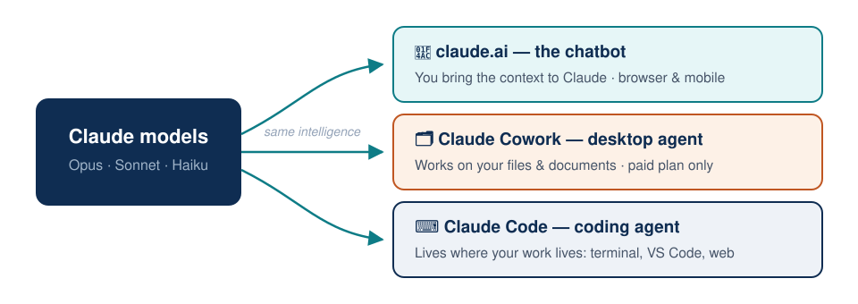
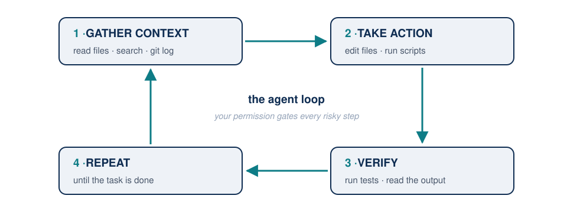
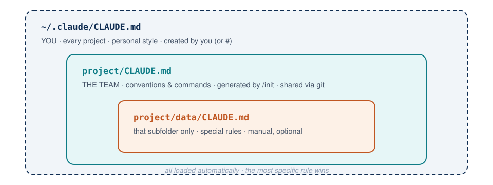
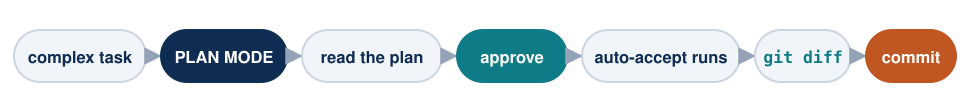
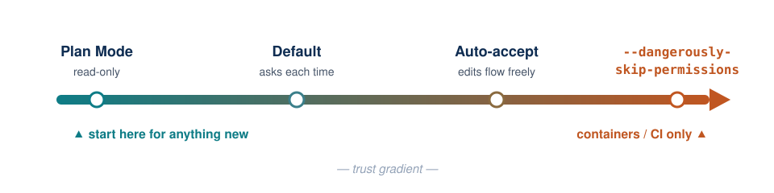

## Plan for today (2 hours) {.smaller}

| Block | Topic | Time |
|-------|-------|------|
| 1 | The Claude ecosystem: claude.ai vs. Cowork vs. Claude Code | 20 min |
| 2 | What "agentic" means + setup check | 20 min |
| 3 | First contact: talking to your repository | 25 min |
| 4 | Project memory: `/init` and `CLAUDE.md` | 15 min |
| 5 | Permission modes: default, auto-accept, **Plan Mode** | 25 min |
| 6 | Hands-on: your first agentic session | 15 min |

[Tomorrow (Day 2): MCPs, subagents, custom commands, dashboards, Whisper for paper discussions, and a full academic workflow.]{.small .muted}

## Why this course?

::: incremental
- AI coding agents are changing how empirical research gets done — data cleaning, econometrics, slides, replication packages.
- The bottleneck is no longer *typing code*. It is **specifying, verifying, and organizing** work.
- Goal for these 4 hours: you leave able to run a **real research task end-to-end** with Claude Code — safely and reproducibly.
:::

. . .

> Based on the academic workflow developed by **Pedro H. C. Sant'Anna** (Emory University):
> [psantanna.com/claude-code-my-workflow](https://psantanna.com/claude-code-my-workflow/workflow-guide.html)

# Block 1 — The Claude Ecosystem

## The ecosystem at a glance

{width=88% fig-align="center"}

## One model family, three products

Anthropic trains the **Claude models** (Opus, Sonnet, Haiku).
You can reach the *same intelligence* through different products:

| Product | Where it lives | Who does the work |
|---------|---------------|-------------------|
| **claude.ai** | Browser / mobile app | *You* copy things in, Claude answers |
| **Claude Cowork** | Desktop app | Claude works on your **files & documents** |
| **Claude Code** | Terminal, VS Code, web | Claude works on your **code & repos** |

. . .

::: {.callout-tip}
## The key distinction
**Chat** = you bring the context to Claude.
**Agent** = Claude goes to where your work lives and acts there.
:::

## claude.ai — the chatbot

- Conversational: questions, drafts, brainstorming, artifacts.
- You **upload** files or paste text; Claude cannot touch your machine.
- Great for: explaining a method, polishing an abstract, one-off questions.

. . .

**Limitation for research:** your project has 40 scripts, data files, a `main.tex`, and a git history. You cannot paste all of that into a chat box — and copying answers back by hand doesn't scale.

## Claude Cowork — the agentic desktop app

- Claude Code's sibling for **non-coding knowledge work**.
- Point it at a folder: it reads, organizes, and edits documents, spreadsheets, PDFs.
- No terminal needed — built for the rest of your team (admin, RAs doing document work).
- [Requires a **paid subscription** (Pro, \$20/mo or higher) — there is no API-key option.]{.warm}

. . .

Think of it as: *"Claude Code for people who never open a terminal."*

## Claude Code — the research workhorse {.smaller}

An **agentic coding tool** that lives in your terminal (and VS Code):

- **Reads** your entire repository — no copy-pasting.
- **Writes and edits** files directly.
- **Runs** commands: `R`, `python`, `git`, `quarto`, tests.
- **Verifies** its own work: runs the code, reads the error, fixes it.
- Asks for **your permission** before acting.

. . .

```bash
cd my-paper/
claude
> "Why do the standard errors differ between table 2 and table 3?"
```

## Which one, when? {.smaller}

| Task | Best tool |
|------|-----------|
| "Explain difference-in-differences with staggered adoption" | claude.ai |
| "Summarize these 30 referee-report PDFs into one memo" | Claude Cowork |
| "Clean this survey data, run the regressions, export LaTeX tables" | **Claude Code** |
| "Refactor my Stata scripts into R and verify identical output" | **Claude Code** |
| "Draft an email to my coauthor" | claude.ai / Cowork |

::: {.callout-note}
Same models underneath — but **how you pay differs by product**. Next slide.
:::

## Access & pricing — what do you actually need? {.smaller}

| Product | Free tier | Subscription | API key (pay-as-you-go) |
|---------|-----------|--------------|-------------------------|
| **claude.ai** | ✅ Limited daily usage | Pro **$20/mo** for real usage | — |
| **Claude Cowork** | ❌ | **Requires a paid plan** (Pro $20/mo or higher) | ❌ Not available via API |
| **Claude Code** | — | Included with Pro / Max / Team | ✅ **Works with just an API key** |

. . .

::: {.callout-tip}
## The lab-friendly path 🎓
**Claude Code + API key** from [console.anthropic.com](https://console.anthropic.com): no subscription needed, you pay only for tokens used — Haiku \$1/\$5, Sonnet \$3/\$15, Opus \$5/\$25 per **million** tokens (in/out). A few dollars of credit covers this whole course. A lab can share one workspace and hand out keys per student.
:::

. . .

Rule of thumb: **heavy daily use → Pro subscription** (flat \$20/mo, includes claude.ai + Cowork + Claude Code). **Occasional / course use → API credits.**

# Block 2 — What Does "Agentic" Mean?

## The agent loop

Claude Code is not autocomplete. It runs a **loop**:

{width=66% fig-align="center"}

::: incremental
- Every action goes through **tools**: Read, Edit, Bash, Search, Web.
- Every risky action requires **your approval** (more on this in Block 5).
- You are the **principal investigator**; Claude is a very fast RA.
:::

## Setup check — do this now {.your-turn .smaller}

**Your turn (5 min):** open a terminal in VS Code (`` Ctrl+` ``) and run:

```bash
claude --version        # should print 2.x
claude                  # starts an interactive session
```

- Not installed? → `curl -fsSL https://claude.ai/install.sh | bash`
- First run asks you to **log in**: with a claude.ai Pro/Max account, *or* with an **API key** from [console.anthropic.com](https://console.anthropic.com) (pay-as-you-go — no subscription needed).
- Also install the **"Claude Code" extension** in VS Code — it shows diffs and lets you launch sessions from the editor.

::: {.callout-warning}
If anything fails, raise your hand now — everything else today depends on this.
:::

# Block 3 — First Contact

## Start where your work lives

Claude Code sees the **current directory** and below. Always start it at the project root:

```bash
cd ~/GitHub/my-research-project
claude
```

First prompts to try on *any* repo — no risk, read-only:

```text
> give me an overview of this repository
> what does scripts/clean_data.R do?
> where is the regression for Table 2 estimated?
> explain the folder structure to a new coauthor
```

## Prompting: be specific, be verifiable {.smaller}

::: columns
::: {.column width="50%"}
**Weak**

```text
> fix the data cleaning
```

```text
> make the plot better
```
:::
::: {.column width="50%"}
**Strong**

```text
> in clean_data.R, missing
  income values are dropped;
  recode them as NA and add
  a missingness indicator.
  Re-run the script to verify.
```
:::
:::

. . .

Rule of thumb: **write the prompt like an email to a new RA** — context, task, definition of done.

## Essential interaction commands {.smaller}

| Command / key | What it does |
|---------------|--------------|
| `@file.R` | Reference a file precisely (tab-completes) |
| <kbd>Esc</kbd> | **Interrupt** Claude mid-action — use it freely |
| <kbd>Esc</kbd> <kbd>Esc</kbd> | Jump back in the conversation and redo |
| `/clear` | Wipe the conversation, keep working |
| `/compact` | Summarize the conversation to free context |
| `/model` | Switch model (Opus = deep, Sonnet = fast, Haiku = cheap) |
| `/cost` | See what this session is consuming |
| `!ls -la` | Run a shell command yourself, output enters the chat |
| `/help` | Everything else |

## Context: the one resource you manage {.smaller}

::: incremental
- Claude has a **context window** — its working memory for the session.
- Everything counts: files read, command outputs, your messages.
- A long, messy session → worse answers. Like an RA juggling 12 tasks.
:::

. . .

**Habits of effective users:**

- One task, one session. Done? → `/clear`.
- Long session getting dumb? → `/compact` (keeps a summary).
- Big new topic? → new session.

# Block 4 — Project Memory: `/init` and `CLAUDE.md`

## The problem

Every `/clear` starts from zero. Claude forgets:

- that you use `renv` and R 4.4, not Python,
- that raw data in `data/raw/` must **never** be modified,
- that tables are exported with `modelsummary` to `tables/`,
- your seed conventions, your folder logic, your style.

. . .

You do not want to repeat this every session.

## The solution: `CLAUDE.md` {.smaller}

A markdown file at the project root, **loaded automatically at every session start**.

```bash
> /init
```

`/init` scans your repo and drafts it for you. Then *you edit it* — it is the most valuable file in the project.

```markdown
# Project: Minimum Wage & Informality (Peru)

## Commands
- Run full pipeline: `Rscript scripts/00_master.R`
- Compile paper: `tectonic main.tex`

## Rules
- NEVER modify anything in data/raw/
- All regressions use `fixest`; cluster SEs at district level
- Figures: ggplot2, saved to figures/ as PDF, width = 6in
```

## Memory hierarchy {.smaller}

| File | Scope | Created by | Use for |
|------|-------|------------|---------|
| `~/.claude/CLAUDE.md` | **You**, all projects | ✍️ You (or the `#` shortcut) | Personal style: "answer concisely", "I use R" |
| `project/CLAUDE.md` | Everyone on this repo | 🤖 `/init` generates it | Commands, conventions, do's & don'ts |
| `project/subdir/CLAUDE.md` | That subfolder | ✍️ You, manually — *optional* | Special rules (e.g., `data/`) |

::: {.callout-note}
## None of these files exist by default
The `~/.claude/` *folder* appears the first time you run `claude`, but every `CLAUDE.md` is created **by you or by a command**: `/init` writes the project one; `#` and `/memory` create the others on demand. Claude then loads them automatically at session start.
:::

. . .

**Shortcut:** start any message with `#` and Claude offers to save it as a memory:

```text
> # always cluster standard errors at the district level
```

. . .

::: {.callout-tip}
Commit `CLAUDE.md` to git. Your coauthors' Claude sessions get the same rules — it becomes **lab infrastructure**.
:::

## The hierarchy, visually

{width=76% fig-align="center"}

# Block 5 — Permission Modes & Plan Mode

## Why permissions exist

Claude Code can run *any* shell command — including destructive ones.
So by default it **asks before**: editing files, running commands, touching git.

Three modes, cycled with <kbd>Shift</kbd>+<kbd>Tab</kbd>:

| Mode | Behavior | When |
|------|----------|------|
| **Default** | Asks approval for each action | Learning, risky tasks |
| **Auto-accept** | Edits/commands run without asking | Routine, trusted tasks |
| **Plan Mode** | **Read-only**: explores and proposes, touches nothing | Before anything complex |

## Auto-accept: "auto mode on"

<kbd>Shift</kbd>+<kbd>Tab</kbd> once → `⏵⏵ accept edits on`

::: incremental
- Claude edits and runs without stopping — 5–10× faster iteration.
- Use it when: the task is well-specified, the repo is under **git**, and you reviewed a plan first.
- Do **not** use it when: touching raw data, credentials, or a repo without version control.
:::

. . .

::: {.callout-warning}
## Git is your seatbelt
Auto-accept + `git diff` afterwards is safe. Auto-accept without git is gambling with your paper.
:::

## Plan Mode: think before touching

<kbd>Shift</kbd>+<kbd>Tab</kbd> twice → `⏸ plan mode on` (or start with `claude --permission-mode plan`)

::: incremental
- Claude can **read and search**, but cannot edit or execute.
- It explores the repo, then presents a **step-by-step plan** for your approval.
- You review → approve → Claude switches to executing *that* plan.
:::

. . .

**This is the single highest-leverage habit:**

{width=100% fig-align="center"}

## Plan Mode: a research example {.smaller}

```text
[plan mode] > I want to add an event-study specification to
  the analysis: same sample as Table 2, leads/lags -4..+4,
  plot with 95% CIs, export figure and LaTeX table.
  Look at how the current regressions are organized first.
```

Claude returns something like:

> 1. Read `03_regressions.R` to reuse the fixest setup and sample filters
> 2. Create `04_event_study.R` with `i(rel_time, ref = -1)` specification
> 3. Plot with `ggiplot`, save to `figures/event_study.pdf`
> 4. Export table via `etable()` to `tables/event_study.tex`
> 5. Run and verify N matches Table 2

**You** catch problems here — at zero cost — not after 200 lines of changes.

## The full safety spectrum {.smaller}

{width=88% fig-align="center"}

- `/permissions` — allowlist specific safe commands (e.g. `Rscript`, `quarto render`) so Default mode asks less.
- `--dangerously-skip-permissions`: never on your laptop with real data.

# Block 6 — Hands-On

## Your first agentic session {.your-turn .smaller}

**Exercise (15 min)** — work in pairs:

1. Create a fresh repo and enter it:
```bash
mkdir qlab-demo && cd qlab-demo && git init && claude
```
2. In **default mode**, ask Claude to download `gapminder` data (CSV) into `data/` and describe it.
3. Run `/init` — read the generated `CLAUDE.md`. Add one rule of your own.
4. Switch to **Plan Mode** (<kbd>Shift</kbd>+<kbd>Tab</kbd> ×2) and ask:
   *"Plan an analysis: life expectancy vs. GDP per capita, by continent, with one regression and one figure."*
5. Read the plan. Change one thing about it. Approve.
6. Switch to **auto-accept** and let it execute. Then: `git diff`, and commit.

::: {.callout-tip}
Finished early? Ask Claude to write a `README.md` and re-run everything from scratch to test reproducibility.
:::

## Day 1 — what you now know

::: incremental
- **claude.ai** chats, **Cowork** handles documents, **Claude Code** works inside your repos.
- Claude Code = agent loop (context → action → verify) + your permissions.
- `CLAUDE.md` via `/init` = persistent project memory, shared through git.
- **Plan Mode → review → auto-accept → git diff** is the professional workflow.
:::

## Tomorrow: Day 2 {.smaller}

- **Custom commands & subagents** — build your own `/lit-review`
- **MCP servers** — connect Claude to GitHub, databases, your browser
- **Dashboards** — from raw CSV to a live Quarto dashboard in minutes
- **Whisper** — seminar recordings → transcripts → structured paper discussions
- **Pedro Sant'Anna's full academic framework** — agents, quality gates, and how to fork it for your own research

. . .

**Homework (10 min):** run `/init` on one of *your* real projects and commit the `CLAUDE.md`.

## References — Day 1 {.smaller}

- Sant'Anna, P. H. C. — *My Claude Code Workflow*: [psantanna.com/claude-code-my-workflow](https://psantanna.com/claude-code-my-workflow/workflow-guide.html)
- Repo: [github.com/pedrohcgs/claude-code-my-workflow](https://github.com/pedrohcgs/claude-code-my-workflow)
- Anthropic — Claude Code docs: [code.claude.com/docs](https://code.claude.com/docs)
- Anthropic — *Claude Code: Best practices for agentic coding* (engineering blog)

[Slides built with Quarto + reveal.js — using Claude Code, of course.]{.small .muted}
